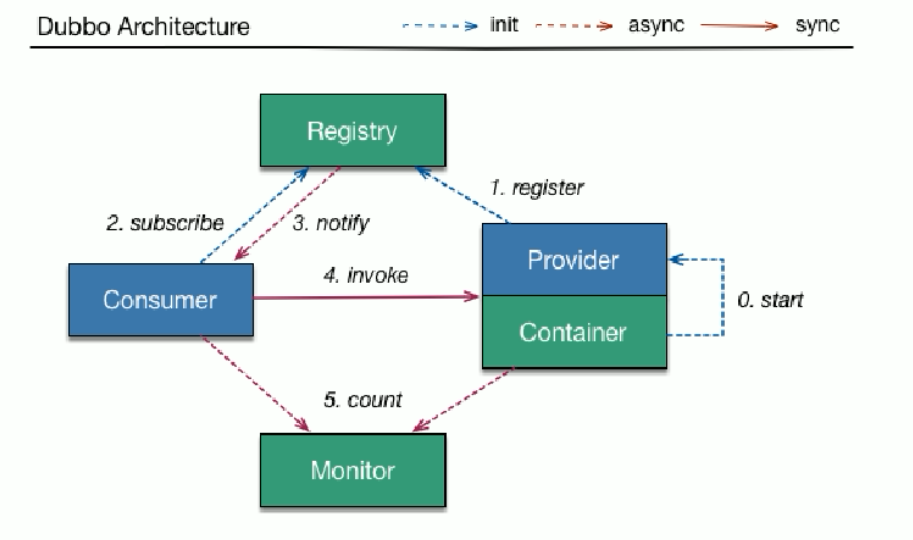
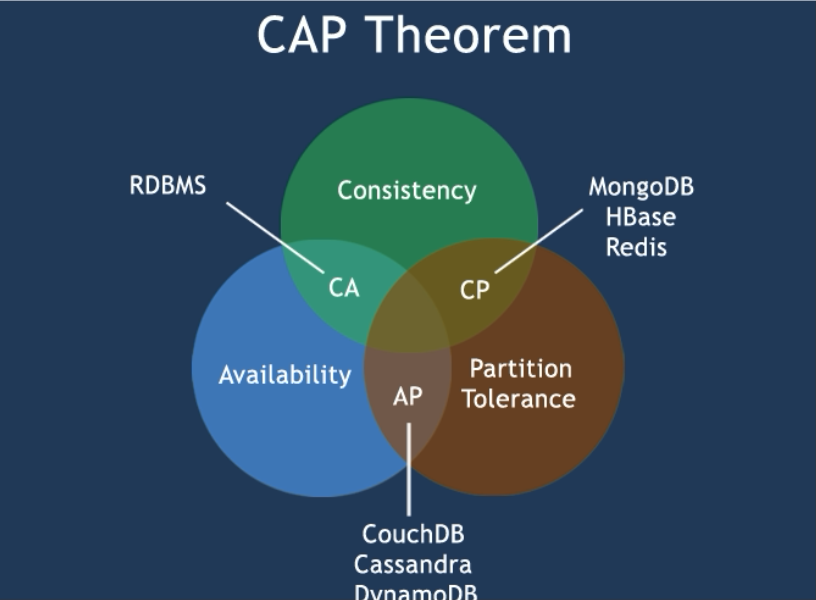
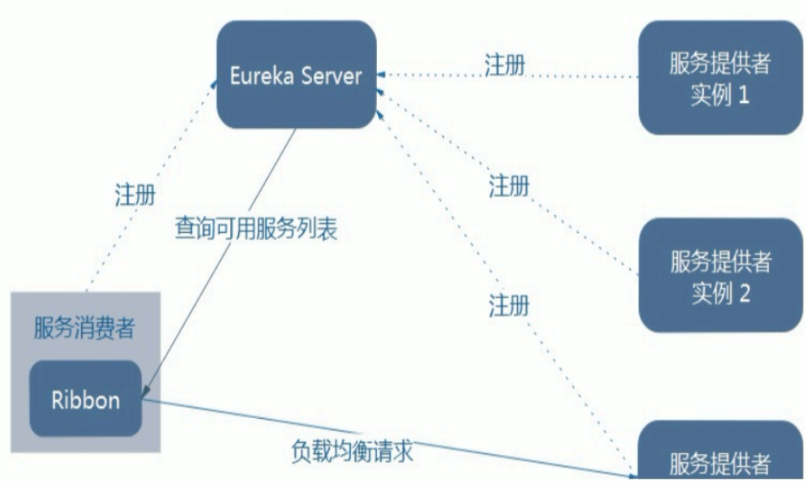
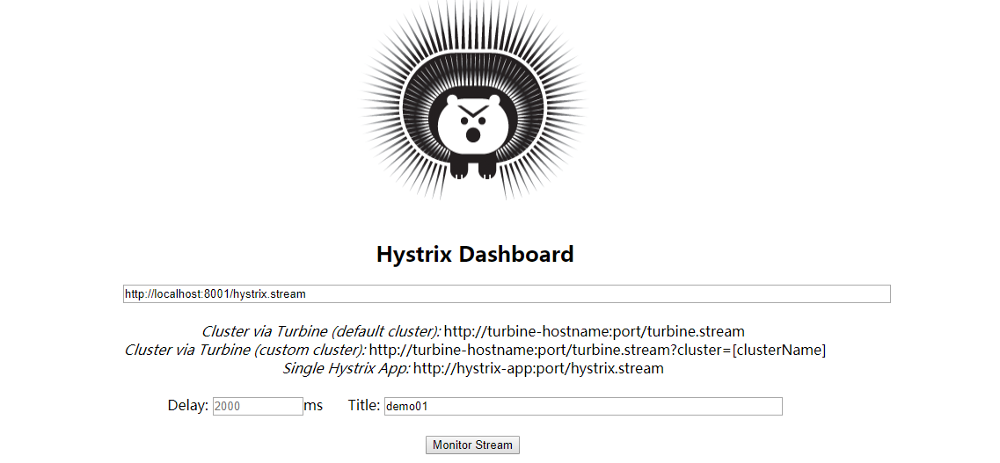
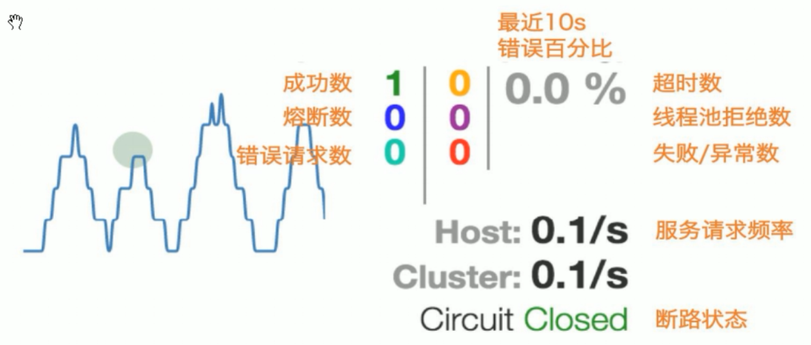
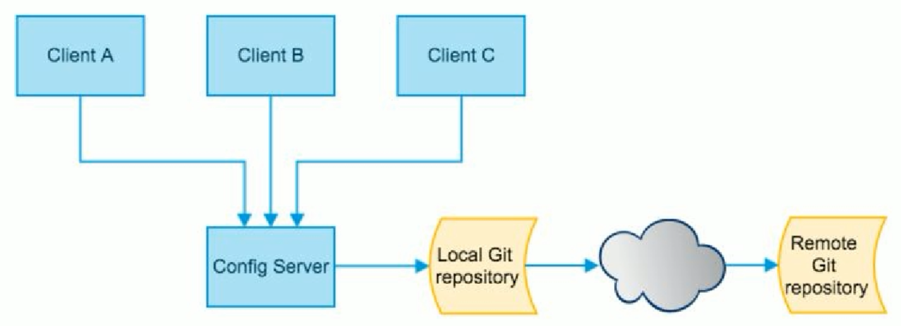

# SpringCloud学习笔记

## Ⅰ.前置知识:

* 学习SpringCloud之前需要具备和掌握如下框架和工具的使用:SpringMVC，Spring，,Spring Boot，Mybatis，Maven，Git。
* SpringCloud不是某一门技术，而是一堆微服务架构技术的集合体，大概有21种之多，我只学习了其中几个比较重要和关键的几种(SpringCloud的5大神兽)，如果想要全面学习还是得参考官方文档。

## Ⅱ.学习大纲

* [微服务概述](#jump4)

* [SpringCloud入门概述](#jump5)

* [Rest微服务构建案例工程模块](#jump6)

* [Eureka服务注册与发现](#jump7)

* [Ribbon负载均衡](#jump8)

* [Feign负载均衡](#jump9)

* [Hystrix断路器](#jump10)

* [Zuul路由网关](#jump11)

* [SpringCloud Config分布式配置中心](#jump12)


## Ⅲ. 问题概览

**3.1 什么是微服务?**

* 详见[《SpringCloud与微服务 Ⅱ --- 微服务概述》](https://www.cnblogs.com/wangxiayun/p/10335104.html)第一段。

**3.2 微服务之间是如何独立通讯的?**

* 采用轻量级的通信机制互相沟通(通常是基于HTTP的RESTful API)。

**3.3 SpringCloud和Dubbo有哪些区别?**

* 通信机制区别:Dubbo是基于RPC远程过程调用，微服务是基于HTTP的REST调用
* 详见[《](https://www.cnblogs.com/wangxiayun/p/10364344.html)[SpringCloud与微服务 Ⅲ --- SpringCloud入门概述](https://www.cnblogs.com/wangxiayun/p/10364344.html)[》](https://www.cnblogs.com/wangxiayun/p/10364344.html)第三段。 

**3.4 什么是服务熔断? 什么是服务降级?**

**3.5 微服务的优缺点是什么?在项目中遇到哪些问题?**

* 详见[《SpringCloud与微服务 Ⅱ --- 微服务概述》](https://www.cnblogs.com/wangxiayun/p/10335104.html)第三段。

**3.6 微服务技术栈有哪些?**

* 详见[《SpringCloud与微服务 Ⅱ --- 微服务概述》](https://www.cnblogs.com/wangxiayun/p/10335104.html)第四段。 

**3.7 Eureka和Zookeeper都可以提供服务注册于发现的功能，两者有什么区别?**

- 详见[《SpringCloud与微服务Ⅴ --- Eureka服务注册与发现》](https://www.cnblogs.com/wangxiayun/p/10376335.html)第十段。

**3.8 Ribbon、Feign、Nginx都可以用来负载均衡，它们有何区别?** 


<span id="jump4"></span>

## Ⅳ.微服务概述 

**4.1 什么是微服务**

- [Martin Fowler论文](https://martinfowler.com/articles/microservices.html#MicroservicesAndSoa)对微服务的阐述([中文版](http://blog.cuicc.com/blog/2015/07/22/microservices/))
- 对单一应用进行拆分
- 每一个独立的应用都有一个独立的进程
- 拥有自己独立的数据库
- 微服务化的核心就是讲传统的一站式应用，根据业务拆分成一个一个的服务,彻底地去耦合，每一个微服务提供单个业务功能的服务，一个服务处理一件事,从技术角度就是一种小而独立的处理过程,类似进程的概念,能够自行单独启动或销毁,拥有自己的数据库。

**4.2 微服务与微服务架构**

- 微服务架构
  * 类似于eclipse工具里面用maven开发的一个个独立的module,具体是使用springboot开发的一个小模块,一个模块就做一件功能。
  * 强调是整体，每一个个体完成一个具体的任务或者功能，把一个个的个体拼接起来，组成一个整体并对外暴露服务。
  * 微服务架构是一种架构模式,它提倡将单一的应用程序划分成一组小的服务,服务之间互相协调、互相配合，为用户提供最终价值。每个服务运行在其独立的进程中，服务与服务间采用轻量级的通信机制互相协作(通常是基于HTTP协议的RESTful API)。每个服务都围绕着具体业务进行构建，并且能够被独立的部署到生产环境、类生产环境等。另外，<u>应当尽量避免统一的、集中式的服务管理机制</u>。对具体的一个服务而言，应根据业务的上下文，选择合适的语言、工具对其进行构建。
- 微服务
  * 强调的是服务的大小，它关注的是某一个点，是具体解决某一个问题/提供落地对应服务的一个服务应用，狭义地看，可以看做Eclipse里面的一个个微服务工程或者Module
- 注意,微服务、微服务架构、Spring Cloud是三种不同的概念，不要弄混淆。

**4.3 微服务的优缺点**

* 优点
  * 每个服务足够内聚，足够小，代码容易理解这样能聚焦一个指定的业务。单机版的应用由于很多业务耦合在一起，修改代码时往往需要读懂一整块的业务功能，而微服务项目只需要了解其中一小块，由于项目足够小并且都是独立的，代码更容易理解，也更容易维护。
  * 开发简单，开发效率提高，精力集中，一个服务只做一件事。
  * 小团队也能单独开发，管理容易，管理成本降低。
  * 微服务是松耦合的，是有功能意义的服务，无论是在开发阶段还是在部署阶段都是独立的，这样可以防止某个项目出问题了其他服务项目不会受到影响。
  * 微服务能使用不同语言开发。
  * 易于和第三方集成，微服务允许容易且灵活的方式集成自动部署，通过持续集成工具，例如Jenkins,Hudson,bamboo。
  * 微服务易于被一个开发人员理解，修改和维护，这样小团队能够更关注自己的工作成果。无需通过合作才能体现价值。
  * 微服务允许你利用融合最新技术。
  * <u>微服务只是业务逻辑代码，不会和HTML，CSS或其他界面组件混合。</u>
  * 每个微服务都有自己的存储能力,可以有自己的数据库,也可以有统一的数据库。可以灵活搭配，连接公共库+连接独立库。
* 缺点
  * 开发人员需要处理分布式系统的复杂性。
  * 多服务运维难度，随着服务的增加，运维的压力也在增大。
  * 系统部署依赖，一个模块调不通有可能影响到其他模块的使用。
  * 服务间通信成本变高。
  * 数据的一致性问题。
  * 系统集成测试变复杂。
  * 性能监控变困难。

**4.4 微服务的技术栈有哪些**

微服务技术栈:多种技术的集合体。

- 服务开发:Spring Boot、Spring、Spring MVC
- 服务的配置与管理:Netflix公司的Archaius、阿里的Diamond等
- 服务注册与发现:Eureka、Consul、Zookeeper等
- 服务调用:Rest、RPC、gRPC
- 服务熔断器:Hystrix、Envoy等
- 服务负载均衡:Ribbon、Nginx等
- 服务接口调用(客户端调用服务的简化工具):Feign等
- 消息队列:Kafka、RabbitMQ、ActiveMQ等
- 服务配置中心管理:SpringCloudConfig、Chef等
- 服务路由(API):Zuul等
- 服务监控:Zabbix、Nagios、Metrics、Spectator等
- 全链路追踪:Zipkin、Brave、Dapper等
- 服务部署:Docker、OpenStack、Kubernetes等
- 数据操作开发包:SpringCloud Stream(封装Redis、RabbitMQ、Kafka等发送接收消息)
- 事件消息总栈:Spring Cloud Bus

**4.5 选择SpringCloud作为微服务架构的理由**

* 选型依据

  * 整体解决方案和框架成熟度
  * 社区热度
  * 可维护性
  * 学习曲线

* 当前IT公司用的微服务架构有哪些?

  * 阿里Dubbo/HSF
  * 京东JSF
  * 新浪微博Motan
  * 当当网DubboX

* 各个微服务框架对比

  结论:SpringCloud满足几乎所有的微服务技术维度要求。

  <span id="jump5"></span>

## Ⅴ.SpringCloud入门概述


### 5.1 什么是SpringCloud

SpringCloud基于SpringBoot提供了一套微服务解决方案，包括服务注册与发现,配置中心，全链路监控，服务网关，负载均衡，熔断器等组件，除了基于NetFlix的开源组件做高度抽象封装之外，还有一些选型的中立的开源组件。

SpringCloud利用Springboot的开发便利性巧妙地简化了分布式系统基础设施的开发，SpringCloud为开发人员提供了快速构建分布式系统的一些工具,包括配置管理、服务发现、断路器、路由、微代理、事件总线、全局锁、决策竞选、分布式会话等等它们都可以利用SpringBoot的开发风格做到一键启动和部署。

SpringBoot并没有重复造轮子，它只是将目前各家公司开发的比较成熟、经得起实际考验的服务框架组合起来，通过SpringBoot风格进行再封装屏蔽掉了复杂的配置和实现原理，最终给开发者留出了一套简单易懂、易部署和易维护的分布式系统开发工具包。

**总结:**SpringCloud是分布式微服务下的一站式解决方案，是各个微服务架构落地技术的集合体，俗称微服务全家桶

### 5.2 SpringCloud与SpringBoot的关系

* SpringBoot关注的是微观，它具体就是一个个的微服务，SpringCloud是宏观的，分布式微服务下的一站式解决方案。通俗的讲，SpringBoot是医院里的一个个科室，而SpringCloud是将这些科室组合起来的整体医院。

* SpringBoot可以单独使用，不需要依赖SpringCloud，而SpringCloud必须依赖于SpringBoot。

* SpringBoot专注于快速方便开发单个个体微服务。

* SpringCloud是关注全局的微服务协调整理治理框架，它将SpringBoot开发的一个个单体微服务整合并管理起来。

  **总结:SpringBoot专注于快速方便开发单个个体微服务,SpringCloud是关注全局的微服务协调整理治理框架。**


### 5.3 Dubbo与SpringBoot对比(重点)

|              | Dubbo         | SpringCloud                  |
| ------------ | ------------- | ---------------------------- |
| 服务注册中心 | Zookeeper     | Spring Cloud Netflix Eureka  |
| 服务调用方式 | RPC           | REST API                     |
| 服务监控     | Dubbo-monitor | Spring Boot Admin            |
| 断路器       | 不完善        | Spring Cloud Netflix Hystrix |
| 服务网关     | 无            | Spring Cloud Netflix Zuul    |
| 分布式配置   | 无            | Spring Cloud Config          |
| 服务跟踪     | 无            | Spring Cloud Sleuth          |
| 消息总线     | 无            | Spring Cloud Bus             |
| 数据流       | 无            | Spring Cloud Stream          |
| 批量任务     | 无            | Spring Cloud Task            |

最大区别: Spring Cloud 抛弃了RPC通信,采用基于HTTP的REST方式。

严格来说两者各有优势。虽然从一定程度上来说，SpringCloud牺牲了服务调用性能，但是也避免了原生RPC带来的问题。而且REST比RPC更灵活，服务提供方和调用方的依赖只依靠一纸契约，不存在代码级别的强依赖，这在强调快速演化的微服务环境下，显得更加适合。

Spring Cloud的功能比Dubbo更为强大，涵盖更广，而且作为Spring的拳头项目，它也能够与Spring Framework、Spring Boot、Spring Data、Spring Batch等其他Spring项目完美融合,这些对于微服务是至关重要的。使用Dubbo构建的微服务架构就像组装电脑，各个环节由我们选择的自由度很高，但最终结果很有可能因为一条内存质量不行就点不亮了，总是让人不怎么放心，如果你是一名大牛，这些都不是问题。而SpringCloud就像是品牌机，在SpringCloud的整合下，做了大量的兼容性测试，保证了机器拥有更高的稳定性，但是如果要在使用非原装组件外的东西，就需要对其基础有足够的了解。

**总结:**Dubbo的定位始终是一款RPC框架，而Spring Cloud的目标是微服务架构下的一站式解决方案。


### 5.4 SpringCloud学习链接

* [各个组件对应的文档](https://springcloud.cc/spring-cloud-netflix.html)
* [SpringCloud 中文社区](http://springcloud.cn/)
* [SpringCloud中文网](https://springcloud.cc/)

<span id="jump6"></span>

## Ⅵ.Rest微服务构建工程

### 6.1 父工程搭建

创建microservice项目。

父工程pom:

```xml
<?xml version="1.0" encoding="UTF-8"?>
<project xmlns="http://maven.apache.org/POM/4.0.0"
         xmlns:xsi="http://www.w3.org/2001/XMLSchema-instance"
         xsi:schemaLocation="http://maven.apache.org/POM/4.0.0 http://maven.apache.org/xsd/maven-4.0.0.xsd">
    <modelVersion>4.0.0</modelVersion>

    <groupId>com.wang.springcloud</groupId>
    <artifactId>microservice</artifactId>
    <version>1.0-SNAPSHOT</version>
    <packaging>pom</packaging>

    <properties>
        <project.build.sourceEncoding>UTF-8</project.build.sourceEncoding>
        <maven.compiler.source>1.8</maven.compiler.source>
        <maven.compiler.target>1.8</maven.compiler.target>
        <junit.version>4.12</junit.version>
        <log4j.version>1.2.17</log4j.version>
        <lombok.version>1.16.18</lombok.version>
    </properties>

    <dependencyManagement>
        <dependencies>
            <dependency>
                <groupId>org.springframework.cloud</groupId>
                <artifactId>spring-cloud-dependencies</artifactId>
                <version>Dalston.SR1</version>
                <type>pom</type>
                <scope>import</scope>
            </dependency>
            <dependency>
                <groupId>org.springframework.boot</groupId>
                <artifactId>spring-boot-dependencies</artifactId>
                <version>1.5.9.RELEASE</version>
                <type>pom</type>
                <scope>import</scope>
            </dependency>
            <dependency>
                <groupId>mysql</groupId>
                <artifactId>mysql-connector-java</artifactId>
                <version>5.0.4</version>
            </dependency>
            <dependency>
                <groupId>com.alibaba</groupId>
                <artifactId>druid</artifactId>
                <version>1.0.31</version>
            </dependency>
            <dependency>
                <groupId>org.mybatis.spring.boot</groupId>
                <artifactId>mybatis-spring-boot-starter</artifactId>
                <version>1.3.0</version>
            </dependency>
            <dependency>
                <groupId>ch.qos.logback</groupId>
                <artifactId>logback-core</artifactId>
                <version>1.2.3</version>
            </dependency>
            <dependency>
                <groupId>junit</groupId>
                <artifactId>junit</artifactId>
                <version>${junit.version}</version>
                <scope>test</scope>
            </dependency>
            <dependency>
                <groupId>log4j</groupId>
                <artifactId>log4j</artifactId>
                <version>${log4j.version}</version>
            </dependency>
        </dependencies>
    </dependencyManagement>

    <build>
        <finalName>microservice</finalName>
        <resources>
            <resource>
                <directory>src/main/resources</directory>
                <filtering>true</filtering>
            </resource>
        </resources>
        <plugins>
            <plugin>
                <groupId>org.apache.maven.plugins</groupId>
                <artifactId>maven-resources-plugin</artifactId>
                <configuration>
                    <delimiters>
                        <delimit>$</delimit>
                    </delimiters>
                </configuration>
            </plugin>
        </plugins>
    </build>


</project>
```

### 6.2 Entity子工程搭建

创建microservice-api项目。

**1.pom依赖**

```xml
<?xml version="1.0" encoding="UTF-8"?>
<project xmlns="http://maven.apache.org/POM/4.0.0"
         xmlns:xsi="http://www.w3.org/2001/XMLSchema-instance"
         xsi:schemaLocation="http://maven.apache.org/POM/4.0.0 http://maven.apache.org/xsd/maven-4.0.0.xsd">
    <parent>
        <artifactId>microservice</artifactId>
        <groupId>com.wang.springcloud</groupId>
        <version>1.0-SNAPSHOT</version>
    </parent>
    <modelVersion>4.0.0</modelVersion>
    <artifactId>microservice-api</artifactId>
    <packaging>jar</packaging>

    <dependencies>
        <dependency>
            <groupId>org.projectlombok</groupId>
            <artifactId>lombok</artifactId>
        </dependency>
    </dependencies>
</project>
```

**2.实体类(这里使用了lombok):**

```java
package com.wang.springcloud.entities;

import lombok.AllArgsConstructor;
import lombok.Data;
import lombok.NoArgsConstructor;
import lombok.experimental.Accessors;

import java.io.Serializable;
@AllArgsConstructor //全参构造
@NoArgsConstructor //无参构造
@Data //生产getter和setter方法
@Accessors(chain = true) //链式风格访问
public class Dept implements Serializable { //Entity
    private Long deptno;
    private String dname;
    private String db_source;//来自哪个数据库，因为微服务架构可以一个服务对应一个数据库，同一个信息被存储到不同数据库

    public Dept(String dname) {
        this.dname = dname;
    }

}
```

完成后使用maven的package命令打包，方便其他项目调用。

### 6.3 服务提供者

创建microservice-provider-dept-8001项目。

**1.pom依赖**

```xml
<project xmlns="http://maven.apache.org/POM/4.0.0" xmlns:xsi="http://www.w3.org/2001/XMLSchema-instance"
         xsi:schemaLocation="http://maven.apache.org/POM/4.0.0 http://maven.apache.org/xsd/maven-4.0.0.xsd">
    <modelVersion>4.0.0</modelVersion>

    <parent>
        <groupId>com.wang.springcloud</groupId>
        <artifactId>microservice</artifactId>
        <version>1.0-SNAPSHOT</version>
    </parent>

    <artifactId>microservicecloud-provider-dept-8001</artifactId>

    <dependencies>
        <!-- 引入自己定义的api通用包，可以使用Dept部门Entity -->
        <dependency>
            <groupId>com.wang.springcloud</groupId>
            <artifactId>microservice-api</artifactId>
            <version>${project.version}</version>
        </dependency>
        <!-- actuator监控信息完善 -->
        <dependency>
            <groupId>org.springframework.boot</groupId>
            <artifactId>spring-boot-starter-actuator</artifactId>
        </dependency>
        <!-- 将微服务provider侧注册进eureka -->
        <dependency>
            <groupId>org.springframework.cloud</groupId>
            <artifactId>spring-cloud-starter-eureka</artifactId>
        </dependency>
        <dependency>
            <groupId>org.springframework.cloud</groupId>
            <artifactId>spring-cloud-starter-config</artifactId>
        </dependency>
        <dependency>
            <groupId>junit</groupId>
            <artifactId>junit</artifactId>
        </dependency>
        <dependency>
            <groupId>mysql</groupId>
            <artifactId>mysql-connector-java</artifactId>
        </dependency>
        <dependency>
            <groupId>com.alibaba</groupId>
            <artifactId>druid</artifactId>
        </dependency>
        <dependency>
            <groupId>ch.qos.logback</groupId>
            <artifactId>logback-core</artifactId>
        </dependency>
        <dependency>
            <groupId>org.mybatis.spring.boot</groupId>
            <artifactId>mybatis-spring-boot-starter</artifactId>
        </dependency>
        <dependency>
            <groupId>org.springframework.boot</groupId>
            <artifactId>spring-boot-starter-jetty</artifactId>
        </dependency>
        <dependency>
            <groupId>org.springframework.boot</groupId>
            <artifactId>spring-boot-starter-web</artifactId>
        </dependency>
        <dependency>
            <groupId>org.springframework.boot</groupId>
            <artifactId>spring-boot-starter-test</artifactId>
        </dependency>
        <!-- 修改后立即生效，热部署 -->
        <dependency>
            <groupId>org.springframework</groupId>
            <artifactId>springloaded</artifactId>
        </dependency>
        <dependency>
            <groupId>org.springframework.boot</groupId>
            <artifactId>spring-boot-devtools</artifactId>
        </dependency>
    </dependencies>

</project>


```

**2.创建数据库并插入几条语句**

```sql
DROP DATABASE IF EXISTS cloudDB01;
CREATE DATABASE cloudDB01 CHARACTER SET UTF8;
USE cloudDB01;
CREATE TABLE dept
(
	deptno BIGINT NOT NULL PRIMARY KEY AUTO_INCREMENT,
	dname VARCHAR(60),
  db_source VARCHAR(60)
);
INSERT INTO dept(dname,db_source) VALUES('开发部',DATABASE());
INSERT INTO dept(dname,db_source) VALUES('人事部',DATABASE());
INSERT INTO dept(dname,db_source) VALUES('财务部',DATABASE());
INSERT INTO dept(dname,db_source) VALUES('市场部',DATABASE());
INSERT INTO dept(dname,db_source) VALUES('运维部',DATABASE());
```

**3.系统配置文件**

```java
server:
  port: 8001
mybatis:
  config-location: classpath:mybatis/mybatis.cfg.xml #mybatis配置文件所在路径
  type-aliases-package: com.wang.springcloud.entities #所有entity别名类所在包
  mapper-locations: classpath:mybatis/mapper/**/*.xml #mapper映射文件

spring:
  application:
    name: microservice-dept
  datasource:
    type: com.alibaba.druid.pool.DruidDataSource  #数据源类型
    driver-class-name: org.gjt.mm.mysql.Driver  #数据库驱动
    url: jdbc:mysql://localhost:3306/cloudDB01  #数据库url
    username: root
    password: 123456
    dbcp2:
      min-idle: 5 #数据库连接池的最小维持连接数
      initial-size: 5 #初始化连接数
      max-total: 5  #最大连接数
      max-wait-millis: 200  #等待连接获取的最大超时时间

```

**4.mybatis的xml配置文件**

```xml
<?xml version="1.0" encoding="UTF-8" ?>
<!DOCTYPE configuration
        PUBLIC "-//mybatis.org//DTD Config 3.0//EN"
        "http://mybatis.org/dtd/mybatis-3-config.dtd">

<configuration>
    <settings>
        <setting name="cacheEnabled" value="true" /><!-- 二级缓存开启 -->
    </settings>
</configuration>


```

**5.mapper接口**

```java
@Mapper
public interface DeptMapper {
    public boolean addDept(Dept dept);

    public Dept findById(Long id);

    public List<Dept> findAll();
}
```

**6.mapper的xml映射**

```xml
<?xml version="1.0" encoding="UTF-8" ?>
<!DOCTYPE mapper PUBLIC "-//mybatis.org//DTD Mapper 3.0//EN"
        "http://mybatis.org/dtd/mybatis-3-mapper.dtd">

<mapper namespace="com.wang.springcloud.mapper.DeptMapper">

    <select id="findById" resultType="Dept" parameterType="Long">
		select deptno,dname,db_source from dept where deptno=#{deptno};
	</select>
    <select id="findAll" resultType="Dept">
		select deptno,dname,db_source from dept;
	</select>
    <insert id="addDept" parameterType="Dept">
		INSERT INTO dept(dname,db_source) VALUES(#{dname},DATABASE());
	</insert>
</mapper>

```

**7.启动类**

```java
package com.wang.springcloud;

import org.springframework.boot.SpringApplication;
import org.springframework.boot.autoconfigure.SpringBootApplication;

@SpringBootApplication
public class DeptProvider8001 {
    public static void main(String[] args) {
        SpringApplication.run(DeptProvider8001.class,args);
    }
}

```

### 6.4 服务消费者

创建microservice-consumer-dept-80项目。

**1.pom依赖**

```xml
<project xmlns="http://maven.apache.org/POM/4.0.0" xmlns:xsi="http://www.w3.org/2001/XMLSchema-instance"
         xsi:schemaLocation="http://maven.apache.org/POM/4.0.0 http://maven.apache.org/xsd/maven-4.0.0.xsd">
    <modelVersion>4.0.0</modelVersion>

    <parent>
        <groupId>com.wang.springcloud</groupId>
        <artifactId>microservice</artifactId>
        <version>1.0-SNAPSHOT</version>
    </parent>

    <artifactId>microservicecloud-consumer-dept-80</artifactId>
    <description>部门微服务消费者</description>

    <dependencies>
        <dependency><!-- 自己定义的api -->
            <groupId>com.wang.springcloud</groupId>
            <artifactId>microservice-api</artifactId>
            <version>${project.version}</version>
        </dependency>
        <!-- Ribbon相关 -->
        <dependency>
            <groupId>org.springframework.cloud</groupId>
            <artifactId>spring-cloud-starter-eureka</artifactId>
        </dependency>
        <dependency>
            <groupId>org.springframework.cloud</groupId>
            <artifactId>spring-cloud-starter-ribbon</artifactId>
        </dependency>
        <dependency>
            <groupId>org.springframework.cloud</groupId>
            <artifactId>spring-cloud-starter-config</artifactId>
        </dependency>
        <dependency>
            <groupId>org.springframework.boot</groupId>
            <artifactId>spring-boot-starter-web</artifactId>
        </dependency>
        <!-- 修改后立即生效，热部署 -->
        <dependency>
            <groupId>org.springframework</groupId>
            <artifactId>springloaded</artifactId>
        </dependency>
        <dependency>
            <groupId>org.springframework.boot</groupId>
            <artifactId>spring-boot-devtools</artifactId>
        </dependency>
    </dependencies>
</project>

```

**2.系统配置文件**

```xml
server:
  port: 80
```

**3.配置类注入RestTemplate**

```java
package com.wang.springcloud.config;

import org.springframework.context.annotation.Bean;
import org.springframework.context.annotation.Configuration;
import org.springframework.web.client.RestTemplate;


@Configuration
public class MyApplicationConfig {
    @Bean
    public RestTemplate getRestTemplate(){
        return new RestTemplate();
    }
}

```

**3.Controller消费服务**

RestTemplate提供了多种便捷访问远程Http服务的方法,是一种简单便捷的访问restful服务的模板类，是Spring提供的用于访问Rest服务的客户端模板工具类。

postForObject(url,requestMap,ResponseBean.class)参数分别代表Rest请求地址，请求参数，HTTP响应被转换成的对象类型

```java
package com.wang.springcloud.controller;

import com.wang.springcloud.entities.Dept;
import org.springframework.beans.factory.annotation.Autowired;
import org.springframework.web.bind.annotation.PathVariable;
import org.springframework.web.bind.annotation.RequestMapping;
import org.springframework.web.bind.annotation.RequestMethod;
import org.springframework.web.bind.annotation.RestController;
import org.springframework.web.client.RestTemplate;

import java.util.List;

@RestController
public class DeptController {
    private static final String REST_URL_PREFIX = "http://localhost:8001";
    @Autowired
    private RestTemplate restTemplate;

    @RequestMapping(value = "/consumer/dept/add",method = RequestMethod.POST)
    public boolean add(Dept dept){
        return restTemplate.postForObject(REST_URL_PREFIX+"/dept/add",dept,Boolean.class);
    }

    @RequestMapping(value = "/consumer/dept/get/{id}",method = RequestMethod.GET)
    public Dept get(@PathVariable("id") Long id){
        return restTemplate.getForObject(REST_URL_PREFIX+"/dept/get/"+id,Dept.class);
    }

    @SuppressWarnings("unchecked")
    @RequestMapping(value = "/consumer/dept/list",method = RequestMethod.GET)
    public List<Dept> list(){
        return restTemplate.getForObject(REST_URL_PREFIX+"/dept/list",List.class);
    }
}

```

<span id="jump7"></span>

## Ⅶ.Eureka注册中心

### 7.1 Eureka是什么

Eureka是Netflix的一个子模块,也是核心模块之一。Eureka是一个基于REST的服务,用于定位服务,以实现云端中间层服务发现和故障转移。服务注册与发现对于微服务架构来说是非常重要的，有了服务发现与注册,只需要使用服务的标识符，就可以访问到服务，而不需要修改服务调用的配置文件了。功能类似于注册中心Zookeeper

### 7.2 Eureka的原理

Spring Cloud 封装了Netfliex公司开发的Eureka模块来实现服务注册和发现。

Eureka采用了C-S的设计架构。Eureka Server作为服务注册功能的服务器,它是服务注册中心。

而系统中的其他微服务，使用Eureka的客户端连接到Eureka Server并维持心跳连接。这样系统的维护人员就可以通过Eureka Server来监控系统中各个微服务是否正常运行。Spring Cloud的一些其他模块(比如Zuul)就可以通过Eureka Server来发现系统中的其他微服务，并执行相关逻辑。

### 7.3 Eureka的基本架构

**Eureka:**


**ZooKeeper:**



Eureka包含两个组件:Eureka Server和Eureka Client

**Eureka Server提供服务注册**

各个节点启动后，会在EurekaServer中进行注册,这样EurekaServer中的服务注册表中将会存储所有可用服务节点信息,服务节点的信息可以在界面中直观看到。

**Eureka Client**

EurekaClient是一个Java客户端,用于简化Eureka Server的交互,客户端同时也具备一个内置的、使用轮询(round-robin)负载算法的负载均衡器。在应用启动后,将会向Eureka Server发送心跳(默认周期为30秒)。如果Eureka Server在多个心跳周期内没有接收到某个节点的心跳,Eureka Server将会从服务注册表中把这个服务节点移除(默认90秒)。

**三大角色**:

* Eureka Server提供服务注册与发现
* Service Provider服务提供方将自身服务注册到Eureka,从而使服务消费方能找到
* Service Consumer服务消费方从Eureka获取注册服务列表,从而能够消费服务


### 7.4 Eureka Server搭建

创建microservicecloud-eureka-7001项目。

**pom文件**

```xml
<project xmlns="http://maven.apache.org/POM/4.0.0" xmlns:xsi="http://www.w3.org/2001/XMLSchema-instance"
         xsi:schemaLocation="http://maven.apache.org/POM/4.0.0 http://maven.apache.org/xsd/maven-4.0.0.xsd">
    <modelVersion>4.0.0</modelVersion>

    <parent>
        <groupId>com.wang.springcloud</groupId>
        <artifactId>microservice</artifactId>
        <version>1.0-SNAPSHOT</version>
    </parent>

    <artifactId>microservicecloud-eureka-7001</artifactId>

    <dependencies>
        <!--eureka-server服务端 -->
        <dependency>
            <groupId>org.springframework.cloud</groupId>
            <artifactId>spring-cloud-starter-eureka-server</artifactId>
        </dependency>
        <!-- 修改后立即生效，热部署 -->
        <dependency>
            <groupId>org.springframework</groupId>
            <artifactId>springloaded</artifactId>
        </dependency>

        <dependency>
            <groupId>org.springframework.boot</groupId>
            <artifactId>spring-boot-devtools</artifactId>
        </dependency>
    </dependencies>

</project>


```

**配置文件**

```properties
server:
  port: 7001

eureka:
  instance:
    hostname: localhost #eureka实例的主机名
  client:
    register-with-eureka: false #不把自己注册到eureka上
    fetch-registry: false #不从eureka上来获取服务的注册信息
    service-url:
      defaultZone: http://${eureka.instance.hostname}:${server.port}/eureka
```

**启动类开启Eureka注解**

```java
//Eureka的Server端
@SpringBootApplication
@EnableEurekaServer //启动该组件的相关注解标签
public class EurekaServer7001 {
    public static void main(String[] args) {
        SpringApplication.run(EurekaServer7001.class,args);
    }
}
```

### 7.5 Eureka注册微服务

修改microservicecloud-provider-dept-8001项目。

**pom文件修改**

```xml
<!-- 新增依赖 --> 
<!-- 将微服务provider注册进eureka -->
        <dependency>
            <groupId>org.springframework.cloud</groupId>
            <artifactId>spring-cloud-starter-eureka</artifactId>
        </dependency>
 		<dependency>
            <groupId>org.springframework.cloud</groupId>
            <artifactId>spring-cloud-starter-config</artifactId>
        </dependency>
```

**yml文件修改**

新增如下配置:

```xml
eureka:
  client:
    service-url:
      defaultZone: http://localhost:7001/eureka
```

**主启动类开启注解**

```java
@SpringBootApplication
@EnableEurekaClient //本服务启动后会自动注册进Eureka服务中
public class DeptProvider8001 {
    public static void main(String[] args) {
        SpringApplication.run(DeptProvider8001.class,args);
    }
}

```

### 7.6 actuator与完善注册微服务信息

**主机名称:服务名称修改**

修改microservicecloud-provider-dept-8001项目application.yml文件。

```properties
eureka:
  client:
    service-url:
      defaultZone: http://localhost:7001/eureka
  instance: 
    instance-id: microservice-dept-8001 
```

**访问信息希望有IP信息提示**

修改microservicecloud-provider-dept-8001项目application.yml文件。

```properties
eureka:
  client:
    service-url:
      defaultZone: http://localhost:7001/eureka
  instance:
    instance-id: microservice-dept-8001
    prefer-ip-address: true #访问路径可以显示ip地址

```

**微服务info详细信息**

修改microservicecloud-provider-dept-8001项目pom文件。

```xml
<!-- 添加 -->
<!-- actuator监控信息完善 -->
        <dependency>
            <groupId>org.springframework.boot</groupId>
            <artifactId>spring-boot-starter-actuator</artifactId>
        </dependency>
```

```xml
<build>
        <finalName>microservice</finalName>
        <resources>
            <resource>
                <directory>src/main/resources</directory>
                <filtering>true</filtering>
            </resource>
        </resources>
        <plugins>
            <plugin>
                <groupId>org.apache.maven.plugins</groupId>
                <artifactId>maven-resources-plugin</artifactId>
                <configuration>
                    <!--以$开头和结尾的信息-->
                    <delimiters>
                        <delimiter>$</delimit>
                    </delimiters>
                </configuration>
            </plugin>
        </plugins>
    </build>
```

修改microservicecloud-provider-dept-8001项目yml文件。

```properties
info:
  app.name: microservice
  company.name: www.waaaa.com
  build.artifactId: $project.artifactId$
  build.version: $project.version$
```

这边我出现了一些问题，用了很多方法都无法动态解析到$$的内容，目前还尚未解决，可能和版本不适配有关系。

### 7.7 Eureka的自我保护机制

Eureka Server启动一段时间后没有任何操作页面会出现如下字样:


某一个微服务不能用了，eureka不会立刻清理，依旧会对该微服务的信息进行保存。

默认情况下，如果EurekaServer在一定时间内没有接收到某个微服务实例的心跳，EurekaServer将会注销该实例(默认90秒)。但是当网络分区故障发生时，微服务与EurekaServer之间无法正常通信。以上行为可能变得非常危险了——因为微服务本身其实是健康的，此时本不应该注销这个微服务。Eureka通过"自我保护机制"来解决这个问题——当Eureka节点在短时间内丢失过多客户端时(可能发生了网络分区故障)，那么这个节点就会进入自我保护模式。一旦进入该模式，EurekaServer就会保护服务注册表中的信息，不再删除服务注册表中的数据(也就不会注销任何微服务)。当网络故障恢复后，该EurekaServer节点会自动退出自我保护模式。

在自我保护模式中，Eureka Server会保护服务注册表中的信息，不再注销任何服务实例。当它收到的心跳数重新恢复到阈值以上时，该Eureka Server会自动退出保护模式。它的设计哲学就是宁可保留错误的服务注册信息，也不注销任何可能健康的服务实例。

### 7.8 Eureka服务发现(了解)

对于注册进Eureka里的微服务，可以通过服务发现来获得该服务的信息

**服务提供者发现服务**

修改microservicecloud-provider-dept-8001项目。

主启动类开启服务发现

```JAVA
@SpringBootApplication
@EnableEurekaClient //本服务启动后会自动注册进Eureka服务中
@EnableDiscoveryClient //服务发现
public class DeptProvider8001 {
    public static void main(String[] args) {
        SpringApplication.run(DeptProvider8001.class,args);
    }
}
```

调用服务发现

```java
  @Autowired
    private DiscoveryClient client;
@RequestMapping(value = "/dept/discovery", method = RequestMethod.GET)
    public Object discovery() {
        List<String> list = client.getServices();
        System.out.println("**********" + list);

        List<ServiceInstance> srvList = client.getInstances("MICROSERVICECLOUD-DEPT");
        for (ServiceInstance element : srvList) {
            System.out.println(element.getServiceId() + "\t" + element.getHost() + "\t" + element.getPort() + "\t"
                    + element.getUri());
        }
        return this.client;
    }
```

**服务消费者发现服务**

修改microservice-consumer-dept-80项目的controller

```java
 // 测试@EnableDiscoveryClient,消费端可以调用服务发现
    @RequestMapping(value = "/consumer/dept/discovery")
    public Object discovery(){
        return restTemplate.getForObject(REST_URL_PREFIX + "/dept/discovery", Object.class);
    }
```


### 7.9 Eureka集群配置(重要)

集群的最大好处是实现服务的高可用。

**集群环境搭建**

1. 新建microservicecloud-eureka-7002和microservicecloud-eureka-7003项目。
2. 拷贝microservicecloud-eureka-7001的pom文件到上述两个项目中，分别修改他们的artifactId。
3. 拷贝microservicecloud-eureka-7001的启动类以及包并修改相应的启动类名称。
4. 拷贝microservicecloud-eureka-7001的yml到7002和7003项目中

**修改映射配置**

修改域名映射,找到系统的host文件(C:\Windows\System32\Drivers\etc )

```
127.0.0.1 eureka7001.com
127.0.0.1 eureka7002.com
127.0.0.1 eureka7003.com
```

修改microservicecloud-eureka-7001的yml配置

```properties
server:
  port: 7001

eureka:
#  server:
#    enable-self-preservation: false #禁用自我保护机制(不推荐)
  instance:
    hostname: eureka7001.com #eureka实例的主机名
  client:
    register-with-eureka: false #不把自己注册到eureka上
    fetch-registry: false #不从eureka上来获取服务的注册信息
    service-url:
      #单机版 defaultZone: http://${eureka.instance.hostname}:${server.port}/eureka
      defaultZone: http://eureka7002.com:7002/eureka,http://eureka7003.com:7003/eureka
```

修改microservicecloud-eureka-7002的yml配置

```properties
server:
  port: 7002

eureka:
#  server:
#    enable-self-preservation: false #禁用自我保护机制(不推荐)
  instance:
    hostname: eureka7002.com #eureka实例的主机名
  client:
    register-with-eureka: false #不把自己注册到eureka上
    fetch-registry: false #不从eureka上来获取服务的注册信息
    service-url:
      #单机版 defaultZone: http://${eureka.instance.hostname}:${server.port}/eureka
      defaultZone: http://eureka7001.com:7001/eureka,http://eureka7003.com:7003/eureka
```

修改microservicecloud-eureka-7003的yml配置

```properties
server:
  port: 7003
  
eureka:
#  server:
#    enable-self-preservation: false #禁用自我保护机制(不推荐)
  instance:
    hostname: eureka7003.com #eureka实例的主机名
  client:
    register-with-eureka: false #不把自己注册到eureka上
    fetch-registry: false #不从eureka上来获取服务的注册信息
    service-url:
      #单机版 defaultZone: http://${eureka.instance.hostname}:${server.port}/eureka
      defaultZone: http://eureka7001.com:7001/eureka,http://eureka7002.com:7002/eureka
```

修改microservice-provider-dept-8001项目的yml文件

```properties
eureka:
  client:
    service-url:
      #defaultZone: http://localhost:7001/eureka
      defaultZone: http://localhost:7001/eureka,http://localhost:7002/eureka,http://localhost:7002/eureka
```

启动项目，分别访问下面地址。

http://eureka7001.com:7001/

http://eureka7002.com:7002/

http://eureka7003.com:7003/

### 7.10 Eureka与Zookeeper对比(重要)

**1.CAP原则**

**C:**Consistency(强一致性)

**A:**Availability(可用性)

**P:**Partition tolerance(分区容错性)

**区别:Eureka准守AP原则，Zookeeper准守CP原则。**

**2.经典CAP图**

CAP最多只能同时较好地满足两个(3进2)。

CAP的核心是: 一个分布式系统不可能同时很好地满足一致性，可用性和分区容错性这三个需求,因此，根据CAP原理将NoSQL数据库分成了满足CA原则、满足CP原则和满足AP原则的三大类:

CA - 单点集群，满足一致性，可用性的系统，通常在可扩展性上不太强大。

CP - 满足一致性,分区容错性的系统,通常性能不高。

AP - 满足可用性，分区容错性的系统，通常对一致性的要求会低一些。



**3.Eureka和Zookeeper对比**

- Zookeeper保证CP:

  当向注册中心查询服务列表时，我们可以容忍注册中心返回的是几分钟以前的注册信息，但不能接受服务down掉不可用。也就是说，服务注册功能对可用性(Availability)的要求高于一致性(Consistency)。使用zookeeper会出现一种情况，当master节点因为网络故障与其他节点失去联系时，剩余节点会重新进行leader选举。问题在于，选举leader的时间过长，30~120s，且选举期间整个zookeeper集群都是不可用的，这就导致在选举期间注册服务瘫痪。在云部署的环境下，因网络问题使得zookeeper集群失去master节点是较大概率会发生的事，虽然服务能最终恢复，但是漫长的选举时间导致注册长期不可用是不可容忍的。

- Eureka保证AP:

  Eureka在设计的时候就考虑到了这一点，优先保证了可用性(Availability)的原则。**Eureka各个节点都是平等的。**几个节点的挂掉不会影响正常节点的工作,剩余节点依然可以提供注册和查询服务。而Eureka客户端在向某个Eureka注册时如果发现连接失败，则会自动切换至其它节点，只要有一台Eureka还在，就能保证注册服务可用性。只不过查到的信息可能不是最新的(不保证强一致性)。除此之外，Eureka还有一种自我保护机制,如果在15分钟内超过85%的节点都没有正常心跳,那么Eureka就认为客户端与注册中心出现了网络故障,此时会出现以下情况:

  1. Eureka不再从注册列表中移除因为长时间没有收到心跳而应该过期的服务
  2. Eureka仍然能够接受新服务的注册和查询请求，但是不会被同步到其它节点上(即保证当前节点依然可用)
  3. 当网络稳定时，当前实例新的注册信息会被同步到其它节点中

  **因此,Eureka可以很好的应对因网络故障导致部分节点失去联系的情况,而不会像zookeeper那样使整个注册服务瘫痪。**

<span id="jump8"></span>

## Ⅷ.Ribbon负载均衡

### 8.1 Ribbon是什么

Sping Cloud  Ribbon是基于Netflix Ribbon实现的一套**客户端负载均衡**的工具。

简单的说,Ribbon是Netflix发布的开源项目,主要功能是提供客户端的软件负载均衡算法,将Netflix的中间层服务连接在一起。Ribbon客户端组件提供一系列完整的配置项如连接超时，重试等。简单地说,就是在配置文件中列出Load Balancer(简称LB) 后面所有的机器, Ribbon会自动的帮助你基于某种规则(如简单轮询,随机连接等)去连接这些机器。我们也很容易使用Ribbon实现自定义的负载均衡算法。

**负载均衡**

LB，即负载均衡(Load Balancer),在微服务或分布式集群中经常用的一种应用。

负载均衡简单的说就是将用户的请求平摊的分配到多个服务上，从而达到系统的HA(高可用)。

常见的负载均衡软件有Nginx,LVS,硬件F5等。

相应的中间件,例如:dubbo和SpringCloud中均给我们提供了负载均衡,SpringCloud的负载均衡算法可以自定义。

* 集中式LB

  即在服务的消费方和提供方之间使用独立的LB设施(可以是硬件F5(好用但是贵)，也可以说软件,如nginx),由该设施负责把访问请求通过某种策略转发至服务的提供方。

* 进程内LB

  将LB逻辑集成到消费方,消费方从服务注册中心获知有哪些地址可用,然后自己再从这些地址中选择出一个合适的服务器。Ribbon就属于进程内LB，它只是一个类库,集成消费方进程,消费方通过它来获取到服务提供方的地址。

**官网资料:**https://github.com/Netflix/ribbon/wiki

### 8.2 Ribbon的初步配置

修改microservice-consumer-dept-80项目。

**修改pom文件:**

```xml
<!-- Ribbon相关 -->
        <dependency>
            <groupId>org.springframework.cloud</groupId>
            <artifactId>spring-cloud-starter-eureka</artifactId>
        </dependency>
        <dependency>
            <groupId>org.springframework.cloud</groupId>
            <artifactId>spring-cloud-starter-ribbon</artifactId>
        </dependency>
        <dependency>
            <groupId>org.springframework.cloud</groupId>
            <artifactId>spring-cloud-starter-config</artifactId>
        </dependency>
        <dependency>
            <groupId>org.springframework.boot</groupId>
            <artifactId>spring-boot-starter-web</artifactId>
        </dependency>
```

**修改yml配置文件:**

追加eureka的服务注册地址。

```properties
eureka:
  client:
    register-with-eureka: false
    service-url:
      #defaultZone: http://localhost:7001/eureka
      defaultZone: http://localhost:7001/eureka,http://localhost:7002/eureka,http://localhost:7002/eureka
```

**在RestTemplate上标注@LoadBalanced:**

实现负载均衡

```java
@Configuration
public class MyApplicationConfig {
    @Bean
    @LoadBalanced //负载均衡
    public RestTemplate getRestTemplate(){
        return new RestTemplate();
    }
}
```

**主启动类注解@EnableEurekaClient**

```java
@SpringBootApplication
@EnableEurekaClient
public class DeptConsumer80 {
    public static void main(String[] args) {
        SpringApplication.run(DeptConsumer80.class,args);
    }
}
```

**修改微服务访问地址:**

修改DeptController类中的REST_URL_PREFIX，使得消费端通过微服务名称来访问提供端的接口。

```java
 //private static final String REST_URL_PREFIX = "http://localhost:8001";
 private static final String REST_URL_PREFIX = "http://MICROSERVICE-DEPT";
```

**结论:**Ribbon和Eureka整合后Consumer可以直接调用服务而不用再关心地址和端口号


### 8.3 Ribbon的负载均衡

**架构图:**



Ribbon在工作时分为两步

第一步先选择EurekaServer,它优先选择在同一个区域内负载较少的server。

第二步再根据用户指定的策略,在从server取到的服务注册列表中选择一个地址。

其中Ribbon提供了多种策略:比如轮询、随机和根据响应时间加权。


**搭建步骤:**

1.新建两个服务提供者microservice-provider-dept-8002、microservice-provider-dept-8003,项目可以参考microservice-provider-dept-8001。

2.新建两个数据库cloudDB02,cloudDB03，表结构与cloudDB01数据库一致

```sql
DROP DATABASE IF EXISTS cloudDB02;
CREATE DATABASE cloudDB01 CHARACTER SET UTF8;
USE cloudDB01;
CREATE TABLE dept
(
	deptno BIGINT NOT NULL PRIMARY KEY AUTO_INCREMENT,
	dname VARCHAR(60),
  db_source VARCHAR(60)
);
INSERT INTO dept(dname,db_source) VALUES('开发部',DATABASE());
INSERT INTO dept(dname,db_source) VALUES('人事部',DATABASE());
INSERT INTO dept(dname,db_source) VALUES('财务部',DATABASE());
INSERT INTO dept(dname,db_source) VALUES('市场部',DATABASE());
INSERT INTO dept(dname,db_source) VALUES('运维部',DATABASE());
```

3.分别修改microservice-provider-dept-8002、microservice-provider-dept-8003的yml文件。

主要修改的是端口号,数据库。

```properties
server:
  port: 8002
spring:
  application:
    name: microservice-dept
  datasource:
    type: com.alibaba.druid.pool.DruidDataSource  #数据源类型
    driver-class-name: org.gjt.mm.mysql.Driver  #数据库驱动
    url: jdbc:mysql://localhost:3306/cloudDB02  #数据库url  
```

4.启动所有项目,分别访问:

http://localhost:8001/dept/get/1

http://localhost:8002/dept/get/1

http://localhost:8003/dept/get/1

若都能访问，说明所有服务都已经启用。

5.启动客户端项目microservice-consumer-dept-80,访问http://localhost/consumer/dept/list。观察返回的数据，并刷新页面。可以看到刷新后的数据分别来自不同数据库，说明已经启用了负载均衡。Ribbon默认采用的算法是轮询算法。

**总结:Ribbon其实就是一个软负载均衡的客户端组件，他可以和其他所需请求的客户端结合使用，和eureka结合只是其中的一个实例。**

### 8.4 Ribbon的核心组件IRule

通过上面的例子我们知道,Ribbon默认采用的算法是轮询算法,那么如何配置自定义负载均衡算法呢？

IRule:根据特定的算法中从服务列表中选取一个要访问的服务。

**Ribbon自带的七种负载均衡算法**

1. **RoundRobinRule**:轮询
2. **RandomRule**:随机
3. **AvailabilityFilteringRule**:先过滤由于多次访问故障而处于断路器跳闸状态的服务，还有并发的连接数量超过阈值的服务，然后对剩余的服务列表按照轮询策略进行访问。
4. **WeightedReponseTimeRule**:根据平均响应时间计算所有服务的权重，响应时间越短服务权重大被选中的概率高,刚启动时如果统计信息不足,则使用轮询策略,等统计信息足够,会切换到WeightedReponseTimeRule
5. **RetryRule**:先按照轮询策略获取服务,如果获取服务失败则在指定时间内会进行重试，获取可用的服务
6. **BestAvailableRule**:先过滤由于多次访问故障而处于断路器跳闸状态的服务，然后选择一个并发量最小的服务
7. **ZoneAvoidanceRule:**默认规则，复合判断server所在区域的性能和server的可用性选择服务器

**切换成随机的负载均衡算法**

需要换哪种算法，只需要在config类里注入该算法的bean，然后重启服务就会生效了。

```java
@Configuration
public class MyApplicationConfig {
    @Bean
    @LoadBalanced //负载均衡
    public RestTemplate getRestTemplate(){
        return new RestTemplate();
    }

    @Bean
    public IRule myIRule(){
        return new RandomRule();
    }
}
```

### 8.5 自定义负载均衡算法

修改microservice-consumer-dept-80项目。

**规则描述**

要求每台服务器被调用5次，然后轮询如下一台同样被调用5次，所有服务器轮询之后又从最初的服务器开始重新调用五次轮询。

**1.自定义算法规则**

```java
public class MyRandomRule extends AbstractLoadBalancerRule
{

	// total = 0 // 当total==5以后，我们指针才能往下走，
	// index = 0 // 当前对外提供服务的服务器地址，
	// total需要重新置为零，但是已经达到过一个5次，我们的index = 1
	// 分析：我们5次，但是微服务只有8001 8002 8003 三台
	// 
	
	private int total = 0; 			// 总共被调用的次数，目前要求每台被调用5次
	private int currentIndex = 0;	// 当前提供服务的机器号

	public Server choose(ILoadBalancer lb, Object key)
	{
		if (lb == null) {
			return null;
		}
		Server server = null;
		while (server == null) {
			if (Thread.interrupted()) {
				return null;
			}
			List<Server> upList = lb.getReachableServers();
			List<Server> allList = lb.getAllServers();

			int serverCount = allList.size();
			if (serverCount == 0) {
				/*
				 * No servers. End regardless of pass, because subsequent passes only get more
				 * restrictive.
				 */
				return null;
			}

//			int index = rand.nextInt(serverCount);// java.util.Random().nextInt(3);
//			server = upList.get(index);

			
//			private int total = 0; 			// 总共被调用的次数，目前要求每台被调用5次
//			private int currentIndex = 0;	// 当前提供服务的机器号
            if(total < 5)
            {
	            server = upList.get(currentIndex);
	            total++;
            }else {
	            total = 0;
	            currentIndex++;
	            if(currentIndex >= upList.size())
	            {
	              currentIndex = 0;
	            }
            }									
			if (server == null) {
				/*
				 * The only time this should happen is if the server list were somehow trimmed.
				 * This is a transient condition. Retry after yielding.
				 */
				Thread.yield();
				continue;
			}

			if (server.isAlive()) {
				return (server);
			}

			// Shouldn't actually happen.. but must be transient or a bug.
			server = null;
			Thread.yield();
		}
		return server;
	}

	@Override
	public Server choose(Object key)
	{
		return choose(getLoadBalancer(), key);
	}
	@Override
	public void initWithNiwsConfig(IClientConfig clientConfig)
	{
		// TODO Auto-generated method stub
	}

}
```

**2.自定义规则的配置类:**

```java
@Configuration
public class MySelfRule {
    @Bean
    public IRule myRule(){
        return new MyRandomRule();  //自定义算法策略
    }
}

```

**注意:**这个自定义配置类MySelfRule.class不能放在@ComponentScan所扫描的包下以及子包下.否则我们自定义的这个配置类就会被所有Ribbon客户端共享。

**3.主启动类添加@RibbonClient**

在启动该微服务的时候就能去加载我们自定义Ribbon配置类，从而使配置生效

```java
@SpringBootApplication
@EnableEurekaClient
@RibbonClient(name = "MICROSERVICE-DEPT",configuration = MySelfRule.class)
public class DeptConsumer80 {
    public static void main(String[] args) {
        SpringApplication.run(DeptConsumer80.class,args);
    }
}
```

以上步骤完成后，重启所有服务器，调用客户端microservice-consumer-dept-80项目的接口。这里需要注意的是,若出现错误，等待一段时间，服务注册的时候会有一定缓冲时间，然后再次访问服务，然后测试负载均衡的策略是否符合自定义的规则。

<span id="jump9"></span>

## Ⅸ.Feign负载均衡

官方文档:https://projects.spring.io/spring-cloud/spring-cloud.html#spring-cloud-feign

### 9.1 Feign是什么

[Feign](https://github.com/Netflix/feign)是一个声明式的Web客户端。它使编写Web服务客户端变得更容易,它的使用方法是定义一个接口,然后在上面添加注解,同时也支持JAX-RS标准的注解。Feign也支持可拔插式的编码器和解码器。SpringCloud对Feign进行了封装,使其支持了SpringMVC标准注解和HttpMessageConverts。Feign可以与Eureka和Ribbon组合使用以支持负载均衡。

### 9.2 Feign能做什么

Feign旨在编写Java Http客户端更加容易。

前面在使用Ribbon+RestTemplate时,利用RestTemplate对http请求的封装处理，形成了一套模板化的调用方法。但是实际开发中,由于对服务依赖的调用可能不止一处,往往一个接口会被多次调用,所以通常都会针对每个微服务自行封装一些客户端类来包装这些依赖服务的调用。所以,Feign在此基础上做了进一步封装,由他来帮助我们定义和实现依赖服务接口的定义。在Feign的实现下,我们只需要创建一个接口并使用注解的方式来配置它(以前是Dao接口上面标注Mapper注解,现在是一个微服务接口上面标注一个Feign即可)，即可完成对服务提供方的接口绑定,简化了使用Spring Cloud Ribbon时，自动封装服务调用客户端的开发量。

**Feign集成了Ribbon**

利用Ribbon维护了MicroServiceCloud-Dept的服务列表信息,并且通过轮询实现了客户端的负载均衡。而与Ribbon不同的是,**通过Feign只需要定义服务绑定接口且以声明式的方法**,优雅而简单的实现了服务调用。

Feign通过接口的方法调用Rest服务(之前是Ribbon+RestTemplate),该请求发送给Eureka服务器(http://MICROSERVICE-DEPT/dept/list),通过feign直接找到服务接口,由于在进行服务调用的时候融合了Ribbon技术,所以也支持负载均衡。

### 9.2 Feign工程构建

**修改microservice-api项目**

**pom文件修改**

```xml
<?xml version="1.0" encoding="UTF-8"?>
<project xmlns="http://maven.apache.org/POM/4.0.0"
         xmlns:xsi="http://www.w3.org/2001/XMLSchema-instance"
         xsi:schemaLocation="http://maven.apache.org/POM/4.0.0 http://maven.apache.org/xsd/maven-4.0.0.xsd">
    <parent>
        <artifactId>microservice</artifactId>
        <groupId>com.wang.springcloud</groupId>
        <version>1.0-SNAPSHOT</version>
    </parent>
    <modelVersion>4.0.0</modelVersion>
    <artifactId>microservice-api</artifactId>
    <packaging>jar</packaging>

    <dependencies>
        <dependency>
            <groupId>org.projectlombok</groupId>
            <artifactId>lombok</artifactId>
        </dependency>
        <!-- Feign相关 -->
        <dependency>
            <groupId>org.springframework.cloud</groupId>
            <artifactId>spring-cloud-starter-feign</artifactId>
        </dependency>
    </dependencies>
</project>
```

**新增API接口类DeptClientService**

```java
package com.wang.springcloud.service;

import com.wang.springcloud.entities.Dept;
import org.springframework.cloud.netflix.feign.FeignClient;
import org.springframework.web.bind.annotation.PathVariable;
import org.springframework.web.bind.annotation.RequestMapping;
import org.springframework.web.bind.annotation.RequestMethod;

import java.util.List;

/**
 *
 * @Description: 修改microservicecloud-api工程，根据已经有的DeptClientService接口

新建

一个实现了FallbackFactory接口的类DeptClientServiceFallbackFactory
 * @author 
 * @date 
 */
@FeignClient(value = "MICROSERVICE-DEPT")
//@FeignClient(value = "MICROSERVICECLOUD-DEPT",fallbackFactory=DeptClientServiceFallbackFactory.class)
public interface DeptClientService
{
    @RequestMapping(value = "/dept/get/{id}", method = RequestMethod.GET)
    public Dept get(@PathVariable("id") long id);

    @RequestMapping(value = "/dept/list", method = RequestMethod.GET)
    public List<Dept> list();

    @RequestMapping(value = "/dept/add", method = RequestMethod.POST)
    public boolean add(Dept dept);
}
```

上述工作完成后，使用clean,package重新打包成jar，方便其他项目调用。

新建microservice-consumer-dept-feign项目。

**microservice-consumer-dept-feign的pom文件**

```xml
<?xml version="1.0" encoding="UTF-8"?>
<project xmlns="http://maven.apache.org/POM/4.0.0"
         xmlns:xsi="http://www.w3.org/2001/XMLSchema-instance"
         xsi:schemaLocation="http://maven.apache.org/POM/4.0.0 http://maven.apache.org/xsd/maven-4.0.0.xsd">
    <parent>
        <artifactId>microservice</artifactId>
        <groupId>com.wang.springcloud</groupId>
        <version>1.0-SNAPSHOT</version>
    </parent>
    <modelVersion>4.0.0</modelVersion>

    <artifactId>microservice-consumer-dept-feign</artifactId>

    <dependencies>
        <dependency><!-- 自己定义的api -->
            <groupId>com.wang.springcloud</groupId>
            <artifactId>microservice-api</artifactId>
            <version>${project.version}</version>
        </dependency>
        <dependency><!-- Feign相关 -->
            <groupId>org.springframework.cloud</groupId>
            <artifactId>spring-cloud-starter-feign</artifactId>
        </dependency>
        <!-- Ribbon相关 -->
        <dependency>
            <groupId>org.springframework.cloud</groupId>
            <artifactId>spring-cloud-starter-eureka</artifactId>
        </dependency>
        <dependency>
            <groupId>org.springframework.cloud</groupId>
            <artifactId>spring-cloud-starter-ribbon</artifactId>
        </dependency>
        <dependency>
            <groupId>org.springframework.cloud</groupId>
            <artifactId>spring-cloud-starter-config</artifactId>
        </dependency>
        <dependency>
            <groupId>org.springframework.boot</groupId>
            <artifactId>spring-boot-starter-web</artifactId>
        </dependency>
        <!-- 修改后立即生效，热部署 -->
        <dependency>
            <groupId>org.springframework</groupId>
            <artifactId>springloaded</artifactId>
        </dependency>
        <dependency>
            <groupId>org.springframework.boot</groupId>
            <artifactId>spring-boot-devtools</artifactId>
        </dependency>
    </dependencies>

</project>
```

**修改DeptController**

```java
@RestController
public class DeptController {
    @Autowired
    private DeptClientService service;

    @RequestMapping(value = "/consumer/dept/get/{id}")
    public Dept get(@PathVariable("id") Long id)
    {
        return this.service.get(id);
    }

    @RequestMapping(value = "/consumer/dept/list")
    public List<Dept> list()
    {
        return this.service.list();
    }

    @RequestMapping(value = "/consumer/dept/add")
    public Object add(Dept dept)
    {
        return this.service.add(dept);
    }

}
```

启动所有项目，等待一段时间待注册完毕后,访问http://localhost/consumer/dept/list,不断刷新页面观察是否有了负载均衡效果。

<span id="jump10"></span>

## Ⅹ.Hystrix断路器

复杂的分布式体系结构中的应用程序有数十个依赖关系,每个依赖关系在某些时候将不可避免地失败。

**服务雪崩**

多个微服务之间调用的时候，假设微服务调用服务B和微服务C，微服务B和微服务C又调用其他服务,这就是所谓的"扇出"。如果扇出的链路上某个微服务的调用响应时间过长或者不可用，对微服务A的调用就会占用越来越多的系统资源，进而引起系统崩溃,所谓的“雪崩效应”。

对于高流量的应用来说,单一的后端依赖可能会导致所有服务器上的所有资源都在几秒钟内饱和。比失败更糟糕的是，这些应用程序还可能导致服务之间的延迟增加，备份队列，线程和其他系统资源紧张，导致整个系统发生更多的级联故障。这些都表示需要对故障和延迟进行隔离和管理，以便单个依赖关系的失败，不能取消整个应用程序或系统。

### 10.1 Hystrix是什么

Hystrix是一个用于处理分布式系统的延迟和容错的开源库，在分布式系统里，许多依赖不可避免的会调用失败，比如超时、异常等，Hystrix能保证在一个依赖出问题的情况下，不会导致整体服务失败，避免级联故障，以提高分布式系统的弹性。

"断路器"本身是一种开关装置，当某个服务单元发生故障之后，通过断路器的故障监控(类似熔断保险丝),向调用方法返回一个符合预期的、可以处理的备选响应(Fallback),而不是长时间的等待或者抛出调用方法无法处理的异常，这样就保证了服务调用方的线程不会被长时间、不必要地占用，从而避免了故障在分布式系统的蔓延，乃至雪崩。

### 10.2 服务熔断

**服务熔断**

熔断机制是应对雪崩效应的一种微服务链路保护机制。

当扇出链路的某个微服务不可用或者响应时间太长时，会进行服务的降级，**进而熔断该节点微服务的调用，快速返回"错误"的响应信息**。当检测到该节点微服务调用响应正常后恢复调用链路。在SpringCloud框架里熔断机制通过Hystrix实现。Hystrix会监控微服务间调用的状况，当失败的调用到一定阈值，缺省是5秒内20次调用失败就会启动熔断机制。熔断机制的注解是@HystrixCommand。

参考microservice-provider-dept-8001项目,新建microservice-provider-dept-hystrix-8001项目

**pom修改**

主要修改的是artifactId以及引入hystrix的依赖

```xml
<project xmlns="http://maven.apache.org/POM/4.0.0" xmlns:xsi="http://www.w3.org/2001/XMLSchema-instance"
         xsi:schemaLocation="http://maven.apache.org/POM/4.0.0 http://maven.apache.org/xsd/maven-4.0.0.xsd">
    <modelVersion>4.0.0</modelVersion>

    <parent>
        <groupId>com.wang.springcloud</groupId>
        <artifactId>microservice</artifactId>
        <version>1.0-SNAPSHOT</version>
    </parent>

    <artifactId>microservice-provider-dept-hystrix-8001</artifactId>

    <dependencies>
        <!-- 引入自己定义的api通用包，可以使用Dept部门Entity -->
        <dependency>
            <groupId>com.wang.springcloud</groupId>
            <artifactId>microservice-api</artifactId>
            <version>${project.version}</version>
        </dependency>
        <!-- actuator监控信息完善 -->
        <dependency>
            <groupId>org.springframework.boot</groupId>
            <artifactId>spring-boot-starter-actuator</artifactId>
        </dependency>
        <!-- 将微服务provider注册进eureka -->
        <dependency>
            <groupId>org.springframework.cloud</groupId>
            <artifactId>spring-cloud-starter-eureka</artifactId>
        </dependency>
        <dependency>
            <groupId>org.springframework.cloud</groupId>
            <artifactId>spring-cloud-starter-config</artifactId>
        </dependency>
        <dependency>
            <groupId>junit</groupId>
            <artifactId>junit</artifactId>
        </dependency>
        <dependency>
            <groupId>mysql</groupId>
            <artifactId>mysql-connector-java</artifactId>
        </dependency>
        <dependency>
            <groupId>com.alibaba</groupId>
            <artifactId>druid</artifactId>
        </dependency>
        <dependency>
            <groupId>ch.qos.logback</groupId>
            <artifactId>logback-core</artifactId>
        </dependency>
        <dependency>
            <groupId>org.mybatis.spring.boot</groupId>
            <artifactId>mybatis-spring-boot-starter</artifactId>
        </dependency>
        <dependency>
            <groupId>org.springframework.boot</groupId>
            <artifactId>spring-boot-starter-jetty</artifactId>
        </dependency>
        <dependency>
            <groupId>org.springframework.boot</groupId>
            <artifactId>spring-boot-starter-web</artifactId>
        </dependency>
        <dependency>
            <groupId>org.springframework.boot</groupId>
            <artifactId>spring-boot-starter-test</artifactId>
        </dependency>
        <!-- 修改后立即生效，热部署 -->
        <dependency>
            <groupId>org.springframework</groupId>
            <artifactId>springloaded</artifactId>
        </dependency>
        <dependency>
            <groupId>org.springframework.boot</groupId>
            <artifactId>spring-boot-devtools</artifactId>
        </dependency>
        <!--hystrix-->
        <dependency>
            <groupId>org.springframework.cloud</groupId>
            <artifactId>spring-cloud-starter-hystrix</artifactId>
        </dependency>
    </dependencies>
    
</project>

```

**yml文件修改**

文件的其他配置不变，只需要修改instance-id以及info的名称就可以了

```properties
eureka:
  client:
    service-url:
      #defaultZone: http://localhost:7001/eureka
      defaultZone: http://localhost:7001/eureka,http://localhost:7002/eureka,http://localhost:7002/eureka
  instance:
    instance-id: microservice-dept-hystrix-8001
    prefer-ip-address: true #访问路径可以显示ip地址
    
info:
  app.name: microservice
  company.name: www.waaaa.com
  build.artifactId: microservice-provider-dept-hystrix-8001
  build.version: 1.0-SNAPSHOT
```

**修改DeptController**

```java
package com.wang.springcloud.controller;

import com.netflix.hystrix.contrib.javanica.annotation.HystrixCommand;
import com.wang.springcloud.entities.Dept;
import com.wang.springcloud.service.DeptService;
import org.springframework.beans.factory.annotation.Autowired;
import org.springframework.cloud.client.ServiceInstance;
import org.springframework.cloud.client.discovery.DiscoveryClient;
import org.springframework.web.bind.annotation.*;

import java.util.List;

@RestController //自带@ResponseBody,无法返回页面
public class DeptController {
    @Autowired
    private DeptService service = null;

    @RequestMapping(value = "/dept/get/{id}", method = RequestMethod.GET)
    //一旦调用服务方法失败并抛出了错误信息后，会自动调用@HystrixCommand标注好的fallbackMethod调用类中的指定方法
    @HystrixCommand(fallbackMethod = "processHystrix_Get")
    public Dept get(@PathVariable("id") Long id)
    {

        Dept dept = this.service.get(id);

        if (null == dept) {
            throw new RuntimeException("该ID：" + id + "没有没有对应的信息");
        }

        return dept;
    }

    public Dept processHystrix_Get(@PathVariable("id") Long id)
    {
        return new Dept().setDeptno(id).setDname("该ID：" + id + "没有没有对应的信息,null--@HystrixCommand")
                .setDb_source("no this database in MySQL");
    }
}

```

**主启动类开启服务熔断**

```java
@SpringBootApplication
@EnableEurekaClient //本服务启动后会自动注册进Eureka服务中
@EnableDiscoveryClient //服务发现
@EnableHystrix //开启Hystrix服务熔断
public class DeptProviderHystrix8001 {
    public static void main(String[] args) {
        SpringApplication.run(DeptProviderHystrix8001.class,args);
    }
}

```

启动所有项目，访问http://172.16.80.15:8001/dept/get/234，查找一个不存在的数据，观察返回信息是否正确。

### 10.3 服务降级

整体资源快不够了，先将某些服务关掉，等资源足够了，再重新开启。

服务的降级是客户端完成的，与服务端没有关系。

**修改microservice-api项目**

新增DeptClientServiceFallbackFactory类。

```java
package com.wang.springcloud.service;

import java.util.List;
import com.wang.springcloud.entities.Dept;
import org.springframework.stereotype.Component;
import feign.hystrix.FallbackFactory;

@Component // 不要忘记添加
public class DeptClientServiceFallbackFactory implements FallbackFactory<DeptClientService>
{
	@Override
	public DeptClientService create(Throwable throwable)
	{
		return new DeptClientService() {
			@Override
			public Dept get(long id)
			{
				return new Dept().setDeptno(id).setDname("该ID：" + id + "没有没有对应的信息,Consumer客户端提供的降级信息,此刻服务Provider已经关闭")
						.setDb_source("no this database in MySQL");
			}

			@Override
			public List<Dept> list()
			{
				return null;
			}

			@Override
			public boolean add(Dept dept)
			{
				return false;
			}
		};
	}
}

```

**修改DeptClientService接口**

```java
@FeignClient(value = "MICROSERVICE-DEPT",fallbackFactory=DeptClientServiceFallbackFactory.class)
public interface DeptClientService
{
    @RequestMapping(value = "/dept/get/{id}", method = RequestMethod.GET)
    public Dept get(@PathVariable("id") long id);

    @RequestMapping(value = "/dept/list", method = RequestMethod.GET)
    public List<Dept> list();

    @RequestMapping(value = "/dept/add", method = RequestMethod.POST)
    public boolean add(Dept dept);
}
```

上面修改好后记得clean,package一下，更新jar包，方便其他项目调用

**修改microservice-consumer-dept-feign项目**

修改yml文件

```pr
feign:
  hystrix:
    enabled: true
```

启动项目,访问http://localhost/consumer/get/1，看看是否正确返回数据，关掉服务提供者项目，再次访问该接口，观察返回的结果。

### 10.4 服务熔断/降级总结

**服务熔断**

一般是某个服务故障或异常引起,类似现实世界中的"保险丝",当某个异常条件被触发,直接熔断整个服务，而不是一直等到此服务超时。

**服务降级**

所谓降级，一般是从整体负荷考虑。就是当某个服务熔断后，服务器不再被调用,此时客户端可以自己准备一个本地的fallback回调，返回一个缺省值。这样做,虽然服务水平下降，但好歹可用，比直接挂掉要强。

### 10.5 服务监控Hystrix Dashboard

除了隔离依赖服务的调用之外，Hystrix还提供了**准实时的调用监控**(Hystrix Dashboard),Hystrix会持续地记录所有通过Hystrix发起的请求的执行信息,并以统计报表和图形的形式展示给用户,包括每秒执行多少请求多少成功,多少失败等。Netflix通过hystrix-metrics-event-stream项目实现了对以上指标的监控。Spring Cloud也提供了Hystrix Dashboard的整合,对监控内容转化成可视化界面。

**工程搭建**

**1.新建microservice-consumer-hystrix-dashboard模块**

**2.pom文件**

```xml
<project xmlns="http://maven.apache.org/POM/4.0.0" xmlns:xsi="http://www.w3.org/2001/XMLSchema-instance"
         xsi:schemaLocation="http://maven.apache.org/POM/4.0.0 http://maven.apache.org/xsd/maven-4.0.0.xsd">
    <modelVersion>4.0.0</modelVersion>

    <parent>
        <groupId>com.wang.springcloud</groupId>
        <artifactId>microservice</artifactId>
        <version>1.0-SNAPSHOT</version>
    </parent>

    <artifactId>microservice-consumer-hystrix-dashboard</artifactId>

    <dependencies>
        <!-- 自己定义的api -->
        <dependency>
            <groupId>com.wang.springcloud</groupId>
            <artifactId>microservice-api</artifactId>
            <version>${project.version}</version>
        </dependency>
        <dependency>
            <groupId>org.springframework.boot</groupId>
            <artifactId>spring-boot-starter-web</artifactId>
        </dependency>
        <!-- 修改后立即生效，热部署 -->
        <dependency>
            <groupId>org.springframework</groupId>
            <artifactId>springloaded</artifactId>
        </dependency>
        <dependency>
            <groupId>org.springframework.boot</groupId>
            <artifactId>spring-boot-devtools</artifactId>
        </dependency>
        <!-- Ribbon相关 -->
        <dependency>
            <groupId>org.springframework.cloud</groupId>
            <artifactId>spring-cloud-starter-eureka</artifactId>
        </dependency>
        <dependency>
            <groupId>org.springframework.cloud</groupId>
            <artifactId>spring-cloud-starter-ribbon</artifactId>
        </dependency>
        <dependency>
            <groupId>org.springframework.cloud</groupId>
            <artifactId>spring-cloud-starter-config</artifactId>
        </dependency>
        <!-- feign相关 -->
        <dependency>
            <groupId>org.springframework.cloud</groupId>
            <artifactId>spring-cloud-starter-feign</artifactId>
        </dependency>
        <!-- hystrix和 hystrix-dashboard相关 -->
        <dependency>
            <groupId>org.springframework.cloud</groupId>
            <artifactId>spring-cloud-starter-hystrix</artifactId>
        </dependency>
        <dependency>
            <groupId>org.springframework.cloud</groupId>
            <artifactId>spring-cloud-starter-hystrix-dashboard</artifactId>
        </dependency>
    </dependencies>
</project>
```

**3.主启动类注解**

开启HystrixDashboard的相关注解。

```java
package com.wang.springcloud;

import org.springframework.boot.SpringApplication;
import org.springframework.boot.autoconfigure.SpringBootApplication;
import org.springframework.cloud.netflix.hystrix.dashboard.EnableHystrixDashboard;

@SpringBootApplication
@EnableHystrixDashboard
public class DeptConsumerHystrixDashboard {
    public static void main(String[] args) {
        SpringApplication.run(DeptConsumerHystrixDashboard.class,args);
    }
}

```

**4.yml文件配置**

```properties
server:
  port: 9001
```

上述步骤配置完成后，启动项目,访问http://localhost:9001/hystrix，若一切顺利，就可以看到Hystrix Dashboard的首页了。



那么该如何使用Hystrix Dashboard呢?

启动3个eureka集群，启动microservice-provider-dept-hystrix-8001。

**填写监控地址**

首先填写好监控地址:http://要监控的主机名:要监控的端口号/hystrix.stream

Delay:该参数用来控制服务器上轮询监控信息的延迟时间，默认为2000毫秒,可以通过配置该属性来降低客户端的网络和CPU消耗。

Title:该参数对应了头部标题Hystrix Stream之后的内容，默认会使用具体监控实例的URL，可以通过配置该信息来展示更合适的标题。

**查看图形化页面**

上述信息填写好后,点击Monitor Stream按钮,来到图形监控页面。


不断刷新http://localhost:8001/dept/get/2页面，然后观察下面的图形变化。

**七色:**左边七个颜色的数字分别对应右边七种颜色说明。

Success成功| Short-Circuited短路 | Bad Request请求无效 | Timeout超时 | Rejected拒绝| Failure失败 | Error %错误

**一圈:**左边实心圆有两种含义，它通过颜色的变化代表了实例的健康程度，它的健康度从绿色<黄色<橙色<红色递减。该实心圆除了颜色的变化之外，它的大小也会根据实例的请求流量发生变化，流量越大该实心圆越大，所以通过实心圆的展示就可以在大量实例中快速的发现故障实例和高压力实例。

**一线:**用来监控2分钟内流量的相对变化，可以通过它观察到流量的上升和下降趋势。




<span id="jump11"></span>

## Ⅺ.Zuul路由网关

### 11.1 Zool是什么

Zuul包含了对请求路由和过滤两个最主要的功能:

其中路由功能负责将外部请求转发到具体的微服务实例上,是实现外部访问统一入口的基础而过滤器功能则负责对请求的处理过程进行干预，是实现请求校验、服务聚合等功能的基础。

**Zuul和Eureka进行整合,将Zuul自身注册为Eureka服务治理下的应用**，同时从Eureka中获得其他微服务的消息，也即以后的访问微服务都是通过Zuul跳转后获得。

Zuul为我们提供了代理、路由、过滤等三大功能。

https://github.com/Netflix/zuul/wiki

### 11.2 路由的基本配置

新建模块microservice-zuul-gateway-9527项目。

**pom文件**

```xml

<project xmlns="http://maven.apache.org/POM/4.0.0" xmlns:xsi="http://www.w3.org/2001/XMLSchema-instance"
         xsi:schemaLocation="http://maven.apache.org/POM/4.0.0 http://maven.apache.org/xsd/maven-4.0.0.xsd">
    <modelVersion>4.0.0</modelVersion>

    <parent>
        <groupId>com.wang.springcloud</groupId>
        <artifactId>microservice</artifactId>
        <version>1.0-SNAPSHOT</version>
    </parent>

    <artifactId>microservice-zuul-gateway-9527</artifactId>

    <dependencies>
        <!-- zuul路由网关 -->
        <dependency>
            <groupId>org.springframework.cloud</groupId>
            <artifactId>spring-cloud-starter-zuul</artifactId>
        </dependency>
        <dependency>
            <groupId>org.springframework.cloud</groupId>
            <artifactId>spring-cloud-starter-eureka</artifactId>
        </dependency>
        <!-- actuator监控 -->
        <dependency>
            <groupId>org.springframework.boot</groupId>
            <artifactId>spring-boot-starter-actuator</artifactId>
        </dependency>
        <!-- hystrix容错 -->
        <dependency>
            <groupId>org.springframework.cloud</groupId>
            <artifactId>spring-cloud-starter-hystrix</artifactId>
        </dependency>
        <dependency>
            <groupId>org.springframework.cloud</groupId>
            <artifactId>spring-cloud-starter-config</artifactId>
        </dependency>
        <!-- 日常标配 -->
        <dependency>
            <groupId>com.wang.springcloud</groupId>
            <artifactId>microservice-api</artifactId>
            <version>${project.version}</version>
        </dependency>
        <dependency>
            <groupId>org.springframework.boot</groupId>
            <artifactId>spring-boot-starter-jetty</artifactId>
        </dependency>
        <dependency>
            <groupId>org.springframework.boot</groupId>
            <artifactId>spring-boot-starter-web</artifactId>
        </dependency>
        <dependency>
            <groupId>org.springframework.boot</groupId>
            <artifactId>spring-boot-starter-test</artifactId>
        </dependency>
        <!-- 热部署插件 -->
        <dependency>
            <groupId>org.springframework</groupId>
            <artifactId>springloaded</artifactId>
        </dependency>
        <dependency>
            <groupId>org.springframework.boot</groupId>
            <artifactId>spring-boot-devtools</artifactId>
        </dependency>
    </dependencies>
</project>

```

**yml配置文件**

```properties
server:
  port: 9527
spring:
  application:
    name: microservice-zuul-gateway
eureka:
  client:
    service-url:
      defaultZone: http://localhost:7001/eureka,http://localhost:7002/eureka,http://localhost:7003/eureka
  instance:
    instance-id: gateway-9527.com
    prefer-ip-address: true
info:
  app.name: microservice
  company.name: www.gateway.com
  build.artifactId: microservice-zuul-gateway-9527
  build.version: 1.0-SNAPSHOT

```

**修改host文件**

修改域名映射,找到系统的host文件(C:\Windows\System32\Drivers\etc ),新增如下映射关系:

```
127.0.0.1 myzuul.com
```

**启动类注解:**

```java
package com.wang.springcloud;

import org.springframework.boot.SpringApplication;
import org.springframework.boot.autoconfigure.SpringBootApplication;
import org.springframework.cloud.netflix.zuul.EnableZuulProxy;

@SpringBootApplication
@EnableZuulProxy
public class ZuulGateWay9527 {
    public static void main(String[] args) {
        SpringApplication.run(ZuulGateWay9527.class,args);
    }
}
```

**启动测试:**

启动3个集群,一个服务提供者，一个路由项目。

使用路由访问:http://myzuul.com:9527/microservice-dept/dept/get/2

### 11.3 路由访问的映射规则

修改路由的访问路径，隐藏真实的路由，对外暴露一个虚拟的路由，防止泄露微服务的名称等信息。

修改microservice-zuul-gateway-9527项目。

**yml修改**

```properties
zuul:
  ignored-services: microservice-dept #隐藏该微服务名称
  routes:
    mydept.serviceId: microservice-dept
    mydept.path: /mydept/**
```

修改完毕后访问:http://myzuul.com:9527/mydept/dept/get/2

若要禁止掉所有真实微服务名称:

```properties
zuul:
  ignored-services: "*"	#隐藏所有微服务名称
```

**设置统一公共前缀**

```properties
zuul:
  prefix: /wang
```

配置完成后重启编译然后访问:http://myzuul.com:9527/wang/mydept/dept/get/2

**完整的yml配置**

```properties
server:
  port: 9527
spring:
  application:
    name: microservice-zuul-gateway
eureka:
  client:
    service-url:
      defaultZone: http://localhost:7001/eureka,http://localhost:7002/eureka,http://localhost:7003/eureka
  instance:
    instance-id: gateway-9527.com
    prefer-ip-address: true


zuul:
  prefix: /wang
  ignored-services: "*" #忽略真实服务名
  routes:
    mydept.serviceId: microservice-dept
    mydept.path: /mydept/**


info:
  app.name: microservice
  company.name: www.gateway.com
  build.artifactId: microservice-zuul-gateway-9527
  build.version: 1.0-SNAPSHOT

```

<span id="jump12"></span>

## Ⅻ.SpringCloud Config分布式配置中心

### 12.1 SpringCloud Config是什么

**分布式系统面临的问题 --- 配置问题**

微服务意味着要将单体应用中的业务拆分成一个个子服务,每个服务的粒度相对较小，因此系统中会出现大量的服务。由于每个服务都需要必要的配置信息才能运行，所以一套集中式的、动态的配置管理设施是必不可少的。SpringCloud提供了ConfigServer来解决这个问题，我们每一个微服务自己带着一个application.yml,上百个配置文件的管理。

**SpringCloud Config是什么**



SpringCloud Config可以从github上获取配置服务信息，为微服务架构中的微服务提供集中化的外部配置支持,配置服务器为各个不同微服务应用的所有环境提供了一个**中心化的外部配置**。

### 12.2 SpringCloud Config的工作原理

SpringCloud Config分为服务端和客户端两部分。

服务端也称为分布式配置中心，它是一个独立的微服务应用，用来连接配置服务器并为客户端提供获取配置信息，加密/解密信息等访问接口。

客户端则是通过指定的配置中心来管理应用资源，以及业务相关的配置内容，并在启动的时候从配置中心获取和加载配置信息配置服务器默认采用git来存储配置信息，这样就有助于对环境配置进行版本管理，并且可以通过git客户端工具来方便的管理和访问配置内容。

### 12.3 SpringCloud Config能做什么

1.集中管理配置文件

2.不同环境不同配置，动态化的配置更新，分环境部署比如dev/test/prod/beta/release

3.运行期间动态调整配置，不再需要每个服务部署的机器上编写配置文件，服务会向配置中心统一拉取配置自己的信息。

4.当配置发生变动时，服务不需要重启即可感知到配置的变化并应用新的配置

5.将配置信息以REST接口的形式暴露

由于SpringCloud Config默认使用GIT来存储配置文件(也支持SVN和本地文件)，但最推荐的还是git，而且使用http/https访问的形式。

### 12.4 SpringCloud Config 服务端

1.在github上新建一个仓库**microservice-config**

2.在本地拉取该项目,使用 git clone git@github.com:SillyBoy007/microservice-config.git

3.在该项目里新建一个application.yml

4.编写yml文件，**并保存为UTF-8格式**

```properties
spring:
  profiles:
    active:
      - dev
---

spring:
  profiles: dev  #开发环境
  application:
    name: microservice-config-wang-dev

---
spring:
  profiles: test  #测试环境
  application:
    name: microservice-config-wang-test
```

5.上传yml文件到github

查看github的Code发现上面已经有了该文件。那么我们该如何读取github上的文件配置信息呢?

**搭建ConfigServer**

创建一个模块microservice-config-3344。

**pom文件**

```xml
<project xmlns="http://maven.apache.org/POM/4.0.0" xmlns:xsi="http://www.w3.org/2001/XMLSchema-instance"
         xsi:schemaLocation="http://maven.apache.org/POM/4.0.0 http://maven.apache.org/xsd/maven-4.0.0.xsd">
    <modelVersion>4.0.0</modelVersion>

    <parent>
        <groupId>com.wang.springcloud</groupId>
        <artifactId>microservice</artifactId>
        <version>1.0-SNAPSHOT</version>
    </parent>

    <artifactId>microservice-config-3344</artifactId>


    <dependencies>
        <!-- springCloud Config -->
        <dependency>
            <groupId>org.springframework.cloud</groupId>
            <artifactId>spring-cloud-config-server</artifactId>
        </dependency>
        <!-- 避免Config的Git插件报错：org/eclipse/jgit/api/TransportConfigCallback -->
        <dependency>
            <groupId>org.eclipse.jgit</groupId>
            <artifactId>org.eclipse.jgit</artifactId>
            <version>4.10.0.201712302008-r</version>
        </dependency>
        <!-- 图形化监控 -->
        <dependency>
            <groupId>org.springframework.boot</groupId>
            <artifactId>spring-boot-starter-actuator</artifactId>
        </dependency>
        <!-- 熔断 -->
        <dependency>
            <groupId>org.springframework.cloud</groupId>
            <artifactId>spring-cloud-starter-hystrix</artifactId>
        </dependency>
        <dependency>
            <groupId>org.springframework.cloud</groupId>
            <artifactId>spring-cloud-starter-eureka</artifactId>
        </dependency>
        <dependency>
            <groupId>org.springframework.cloud</groupId>
            <artifactId>spring-cloud-starter-config</artifactId>
        </dependency>
        <dependency>
            <groupId>org.springframework.boot</groupId>
            <artifactId>spring-boot-starter-jetty</artifactId>
        </dependency>
        <dependency>
            <groupId>org.springframework.boot</groupId>
            <artifactId>spring-boot-starter-web</artifactId>
        </dependency>
        <dependency>
            <groupId>org.springframework.boot</groupId>
            <artifactId>spring-boot-starter-test</artifactId>
        </dependency>
        <!-- 热部署插件 -->
        <dependency>
            <groupId>org.springframework</groupId>
            <artifactId>springloaded</artifactId>
        </dependency>
        <dependency>
            <groupId>org.springframework.boot</groupId>
            <artifactId>spring-boot-devtools</artifactId>
        </dependency>
    </dependencies>
</project>
```

**yml文件配置**

```properties
server:
  port: 3344
spring:
  application:
    name: microservice-config
  cloud:
    config:
      server:
        git:
          uri: git@github.com:SillyBoy007/microservice-config.git #git仓库地址
```

**主启动类注解**

```java
@SpringBootApplication
@EnableConfigServer
public class SpringCloudConfig3344 {
    public static void main(String[] args) {
        SpringApplication.run(SpringCloudConfig3344.class,args);
    }
}

```

**修改系统host文件,增加映射**

```
127.0.0.1 config3344.com
```

**测试通过microservice-config-3344是否可以从github上获取配置内容**

启动microservice-config-3344项目,分别访问下列的地址

http://config3344.com:3344/application-dev.yml

http://config3344.com:3344/application-test.yml

http://config3344.com:3344/application-dasdd.yml

**配置读取规则**

1./{application}-{profile}.yml 

http://config3344.com:3344/application-dev.yml

2./{application}/{profile}[/{label}]

http://config3344.com:3344/applicaiton/test/master

3./label/{application}-{profile}.yml

http://config3344.com:3344/master/application-test.yml

### 12.5 SpringCloud Config 客户端

**1.在microservice-config项目下新建一个microservice-config-client.yml文件(以UTF-8格式保存)。**

```properties
spring:
  profiles:
    active:
    - dev

---
server:
  port: 8201
spring:
  profiles: dev
  application:
    name: microservice-config-client

eureka:
  client:
    service-url:
      defaultZone: http://eureka-dev.com:7001/eureka/

---
server:
  port: 8202
spring:
  profiles: test
  application:
    name: microservice-config-client
eureka:
  client:
    service-url:
      defaultZone: http://eureka-test.com:7001/eureka/
```

**2.将上述的文件上传到github上。**

**3.新建microservice-config-client-3355项目**

pom文件:

```xml
<project xmlns="http://maven.apache.org/POM/4.0.0" xmlns:xsi="http://www.w3.org/2001/XMLSchema-instance"
         xsi:schemaLocation="http://maven.apache.org/POM/4.0.0 http://maven.apache.org/xsd/maven-4.0.0.xsd">
    <modelVersion>4.0.0</modelVersion>

    <parent>
        <groupId>com.wang.springcloud</groupId>
        <artifactId>microservice</artifactId>
        <version>1.0-SNAPSHOT</version>
    </parent>

    <artifactId>microservice-config-client-3355</artifactId>

    <dependencies>
        <!-- SpringCloud Config客户端 -->
        <dependency>
            <groupId>org.springframework.cloud</groupId>
            <artifactId>spring-cloud-starter-config</artifactId>
        </dependency>
        <dependency>
            <groupId>org.springframework.boot</groupId>
            <artifactId>spring-boot-starter-actuator</artifactId>
        </dependency>
        <dependency>
            <groupId>org.springframework.cloud</groupId>
            <artifactId>spring-cloud-starter-hystrix</artifactId>
        </dependency>
        <dependency>
            <groupId>org.springframework.cloud</groupId>
            <artifactId>spring-cloud-starter-eureka</artifactId>
        </dependency>
        <dependency>
            <groupId>org.springframework.cloud</groupId>
            <artifactId>spring-cloud-starter-config</artifactId>
        </dependency>
        <dependency>
            <groupId>org.springframework.boot</groupId>
            <artifactId>spring-boot-starter-jetty</artifactId>
        </dependency>
        <dependency>
            <groupId>org.springframework.boot</groupId>
            <artifactId>spring-boot-starter-web</artifactId>
        </dependency>
        <dependency>
            <groupId>org.springframework.boot</groupId>
            <artifactId>spring-boot-starter-test</artifactId>
        </dependency>
        <dependency>
            <groupId>org.springframework</groupId>
            <artifactId>springloaded</artifactId>
        </dependency>
        <dependency>
            <groupId>org.springframework.boot</groupId>
            <artifactId>spring-boot-devtools</artifactId>
        </dependency>
    </dependencies>
</project>

```

**新建bootstrap.yml**

application.yml是用户级的资源配置项

bootstrap.yml是系统级的，优先级更高

SpringCloud会创建一个‘BootStrap Context’，作为Spring应用的`Application Context`的父上下文。初始化的时候‘BootStrap Context’负责从外部源加载配置属性并解析配置。这两个上下文共享一个从外部获取的'Environment'。'BootStrap'属性有高优先级,默认情况下，它们不会被本地配置覆盖。'BootStrap context'和'Application Context'有着不同的约定, 所以新增了一个'bootstrap.yml'文件,保证'BootStrap Context'和'Application Context'配置的分离。

```properties
spring:
  cloud:
    config:
      name: microservice-config-client #需要从github上读取的资源名称，没有yml后缀名
      profile: dev
      label: master
      uri: http://config3344.com:3344 #本微服务启动后先去找3344号服务,通过SpringCloud Config获取GitHub的服务地址 
```

**新建application.yml**

```properties
spring:
  application:
    name: microservice-config-client
```

**host域名映射**

```properties
127.0.0.1 client-config.com
```

**主启动类**

```java
package com.wang.springcloud;

import org.springframework.boot.SpringApplication;
import org.springframework.boot.autoconfigure.SpringBootApplication;

@SpringBootApplication
public class ConfigClient3355 {
    public static void main(String[] args) {
        SpringApplication.run(ConfigClient3355.class,args);
    }
}

```


**新建RestController类测试**

```java
package com.wang.springcloud.controller;

import org.springframework.beans.factory.annotation.Value;
import org.springframework.web.bind.annotation.RequestMapping;
import org.springframework.web.bind.annotation.RestController;

@RestController
public class ConfigClientRestController {
    @Value("${spring.application.name}")
    private String applicationName;
    @Value("${eureka.client.service-url.defaultZone}")
    private String eurekaServers;
    @Value("${server.port}")
    private String port;
    @RequestMapping
    public String getConfig(){
        return "applicationName："+applicationName+"\t eurekaServers："+eurekaServers+"\t port："+port;
    }
}


```

**测试:**

1.先启动microservice-config-3344项目,再启动microservice-config-client-3355项目。

2.访问http://client-config.com:8201/，http://client-config.com:8201/config

3.修改bootstrap.yml，将环境profile切换为test

4.访问http://client-config.com:8202/ , http://client-config.com:8202/config

### 12.6 SpringCloud Config 实际应用

修改microservice-config项目

**1.新建microservice-config-eureka-client.yml**

```properties
spring:
  profiles:
    active:
    - dev
---
server:
  port: 7001
spring:
  profiles: dev
  application:
    name: microservice-config-eureka-client

eureka:
  instance:
    hostname: eureka7001.com #eureka实例的主机名
  client:
    register-with-eureka: false #不把自己注册到eureka上
    fetch-registry: false #不从eureka上来获取服务的注册信息
    service-url:
      defaultZone: http://eureka7001.com:7001/eureka/

---

server:
  port: 7001

spring:
  profiles: test
  application:
    name: microservice-config-eureka-client
eureka:
  instance:
    hostname: eureka7001.com #eureka实例的主机名
  client:
    register-with-eureka: false #不把自己注册到eureka上
    fetch-registry: false #不从eureka上来获取服务的注册信息
    service-url:
      defaultZone: http://eureka7001.com:7001/eureka/
```

**2.新建microservice-config-dept-client.yml**

```properties
spring:
  profiles:
    active:
    - dev
---
server:
  port: 8001
spring:
  profiles: dev
  application:
    name: microservice-config-dept-client
  datasource:
    type: com.alibaba.druid.pool.DruidDataSource  #数据源类型
    driver-class-name: org.gjt.mm.mysql.Driver #数据库驱动
    url: jdbc:mysql://localhost:3306/cloudDB01  #数据库url
    username: root
    password: 123456
    dbcp2:
      min-idle: 5 #数据库连接池的最小维持连接数
      initial-size: 5 #初始化连接数
      max-total: 5  #最大连接数
      max-wait-millis: 200 #等待连接获取的最大超时时间
mybatis:
  config-location: classpath:mybatis/mybatis.cfg.xml #mybatis配置文件所在路径
  type-aliases-package: com.wang.springcloud.entities #所有entity别名类所在包
  mapper-locations: classpath:mybatis/mapper/**/*.xml #mapper映射文件
eureka:
  client:
    service-url:
      defaultZone: http://eureka7001.com:7001/eureka
---
server:
  port: 8002
spring:
  profiles: test
  application:
    name: microservice-config-dept-client
  datasource:
    type: com.alibaba.druid.pool.DruidDataSource  #数据源类型
    driver-class-name: org.gjt.mm.mysql.Driver #数据库驱动
    url: jdbc:mysql://localhost:3306/cloudDB02  #数据库url
    username: root
    password: 123456
    dbcp2:
      min-idle: 5 #数据库连接池的最小维持连接数
      initial-size: 5 #初始化连接数
      max-total: 5  #最大连接数
      max-wait-millis: 200 #等待连接获取的最大超时时间
mybatis:
  config-location: classpath:mybatis/mybatis.cfg.xml #mybatis配置文件所在路径
  type-aliases-package: com.wang.springcloud.entities #所有entity别名类所在包
  mapper-locations: classpath:mybatis/mapper/**/*.xml #mapper映射文件
eureka:
  client:
    service-url:
      defaultZone: http://eureka7001.com:7001/eureka
```

**3.上传上述两个新文件到github**

**4.新建microservice-config-eureka-server-7001项目**

**pom文件**

```xml

<project xmlns="http://maven.apache.org/POM/4.0.0" xmlns:xsi="http://www.w3.org/2001/XMLSchema-instance"
         xsi:schemaLocation="http://maven.apache.org/POM/4.0.0 http://maven.apache.org/xsd/maven-4.0.0.xsd">
    <modelVersion>4.0.0</modelVersion>

    <parent>
        <groupId>com.wang.springcloud</groupId>
        <artifactId>microservice</artifactId>
        <version>1.0-SNAPSHOT</version>
    </parent>
    <artifactId>microservice-config-eureka-server-7001</artifactId>
    
    <dependencies>
        <!-- SpringCloudConfig配置 -->
        <dependency>
            <groupId>org.springframework.cloud</groupId>
            <artifactId>spring-cloud-starter-config</artifactId>
        </dependency>
        <dependency>
            <groupId>org.springframework.cloud</groupId>
            <artifactId>spring-cloud-starter-eureka-server</artifactId>
        </dependency>
        <!-- 热部署插件 -->
        <dependency>
            <groupId>org.springframework</groupId>
            <artifactId>springloaded</artifactId>
        </dependency>
        <dependency>
            <groupId>org.springframework.boot</groupId>
            <artifactId>spring-boot-devtools</artifactId>
        </dependency>
    </dependencies>
</project>

```

**bootstrap.yml**

```properties
spring:
  cloud:
    config:
      name: microservice-config-eureka-server
      profile: dev
      label: master
      uri: http://config3344.com:3344 #本微服务启动后先去找3344号服务,通过SpringCloud Config获取GitHub的服务地址
```

**application.yml**

```properties
spring:
  application:
    name: microservice-config-eureka-server
```

**主启动类**

```java
package com.wang.springcloud;

import org.springframework.boot.SpringApplication;
import org.springframework.boot.autoconfigure.SpringBootApplication;
import org.springframework.cloud.netflix.eureka.server.EnableEurekaServer;

@SpringBootApplication
@EnableEurekaServer
public class ConfigEurekaServer7001 {
    public static void main(String[] args) {
        SpringApplication.run(ConfigEurekaServer7001.class,args);
    }
}

```

**4.新建microservice-config-dept-client-8001项目**

**pom文件**

```xml

<project xmlns="http://maven.apache.org/POM/4.0.0" xmlns:xsi="http://www.w3.org/2001/XMLSchema-instance"
         xsi:schemaLocation="http://maven.apache.org/POM/4.0.0 http://maven.apache.org/xsd/maven-4.0.0.xsd">
    <modelVersion>4.0.0</modelVersion>

    <parent>
        <groupId>com.wang.springcloud</groupId>
        <artifactId>microservice</artifactId>
        <version>1.0-SNAPSHOT</version>
    </parent>

    <artifactId>microservice-config-dept-client-8001</artifactId>

    <dependencies>
        <!-- SpringCloudConfig配置 -->
        <dependency>
            <groupId>org.springframework.cloud</groupId>
            <artifactId>spring-cloud-starter-config</artifactId>
        </dependency>
        <dependency>
            <groupId>org.springframework.boot</groupId>
            <artifactId>spring-boot-starter-actuator</artifactId>
        </dependency>
        <dependency>
            <groupId>org.springframework.cloud</groupId>
            <artifactId>spring-cloud-starter-eureka</artifactId>
        </dependency>
        <dependency>
            <groupId>com.wang.springcloud</groupId>
            <artifactId>microservice-api</artifactId>
            <version>${project.version}</version>
        </dependency>
        <dependency>
            <groupId>junit</groupId>
            <artifactId>junit</artifactId>
        </dependency>
        <dependency>
            <groupId>mysql</groupId>
            <artifactId>mysql-connector-java</artifactId>
        </dependency>
        <dependency>
            <groupId>com.alibaba</groupId>
            <artifactId>druid</artifactId>
        </dependency>
        <dependency>
            <groupId>ch.qos.logback</groupId>
            <artifactId>logback-core</artifactId>
        </dependency>
        <dependency>
            <groupId>org.mybatis.spring.boot</groupId>
            <artifactId>mybatis-spring-boot-starter</artifactId>
        </dependency>
        <dependency>
            <groupId>org.springframework.boot</groupId>
            <artifactId>spring-boot-starter-jetty</artifactId>
        </dependency>
        <dependency>
            <groupId>org.springframework.boot</groupId>
            <artifactId>spring-boot-starter-web</artifactId>
        </dependency>
        <dependency>
            <groupId>org.springframework.boot</groupId>
            <artifactId>spring-boot-starter-test</artifactId>
        </dependency>
        <dependency>
            <groupId>org.springframework</groupId>
            <artifactId>springloaded</artifactId>
        </dependency>
        <dependency>
            <groupId>org.springframework.boot</groupId>
            <artifactId>spring-boot-devtools</artifactId>
        </dependency>
    </dependencies>
</project>


```

**bootstrap.yml**

```properties
spring:
  cloud:
    config:
      name: microservice-config-dept-client #需要从github上读取的资源名称，注意没有yml后缀名
      #profile配置是什么就取什么配置dev or test
      profile: dev	#配置环境
      #profile: test
      label: master
      uri: http://config3344.com:3344  #SpringCloudConfig获取的服务地址


```

**application.yml**

```properties
spring:
  application:
    name: microservice-config-dept-client

```

**4.拷贝microservice-provider-dept-8001项目的mybatis资源文件以及mapper、service业务代码**

**5.启动测试**

先启动microservice-config-3344,然后启动microservice-config-eureka-client，最后启动microservice-config-dept-client-8001，访问http://localhost:7001/，可以看到8001服务已经注册到eureka中了,访问http://localhost:8001/dept/get/1 , 然后切换test环境，访问http://localhost:8002/dept/get/1，可以看到数据的来源也切换了。

## 

## XIII.SpringCloud Config分布式配置中心

