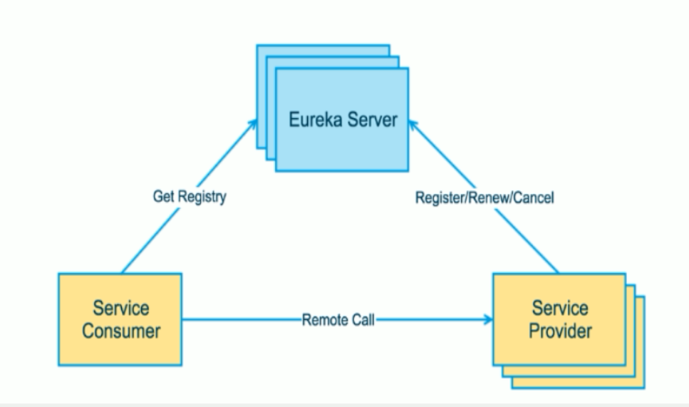

# SpringCloud学习概述

## 一. 前置知识:

* 学习SpringCloud之前需要具备和掌握如下框架和工具的使用:SpringMVC，Spring，,Spring Boot，Mybatis，Maven，Git。
* SpringCloud不是某一门技术，而是一堆微服务架构技术的集合体，大概有21种之多，我只学习了其中几个比较重要和关键的几种(SpringCloud的5大神兽)，如果想要全面学习还是得参考官方文档。

## 二. 学习大纲

* [微服务概述](#jump)

* SpringCloud入门概述

* Rest微服务构建案例工程模块

* Eureka服务注册与发现

* Ribbon负载均衡

* Feign负载均衡

* Hystrix断路器

* zuul路由网关

* SpringCloud Config分布式配置中心

  

## 三. 问题概览

**3.1 什么是微服务?**

* 详见[《SpringCloud与微服务 Ⅱ --- 微服务概述》](https://www.cnblogs.com/wangxiayun/p/10335104.html)第一段。

**3.2 微服务之间是如何独立通讯的?**

* 采用轻量级的通信机制互相沟通(通常是基于HTTP的RESTful API)。

**3.3 SpringCloud和Dubbo有哪些区别?**

* 通信机制区别:Dubbo是基于RPC远程过程调用，微服务是基于HTTP的REST调用

**3.4 什么是服务熔断? 什么是服务降级?**

**3.5 微服务的优缺点是什么?在项目中遇到哪些问题?**

* 详见[《SpringCloud与微服务 Ⅱ --- 微服务概述》](https://www.cnblogs.com/wangxiayun/p/10335104.html)第三段。

**3.6 微服务技术栈有哪些?**

**3.7 Eureka和Zookeeper都可以提供服务注册于发现的功能，两者有什么区别?**

 <span id="jump">Hello World</span>

## 四.微服务概述

**4.1 什么是微服务**

- [Martin Fowler论文](https://martinfowler.com/articles/microservices.html#MicroservicesAndSoa)对微服务的阐述([中文版](http://blog.cuicc.com/blog/2015/07/22/microservices/))
- 对单一应用进行拆分
- 每一个独立的应用都有一个独立的进程
- 拥有自己独立的数据库
- 微服务化的核心就是讲传统的一站式应用，根据业务拆分成一个一个的服务,彻底地去耦合，每一个微服务提供单个业务功能的服务，一个服务处理一件事,从技术角度就是一种小而独立的处理过程,类似进程的概念,能够自行单独启动或销毁,拥有自己的数据库。

**4.2 微服务与微服务架构**

- 微服务架构
  * 类似于eclipse工具里面用maven开发的一个个独立的module,具体是使用springboot开发的一个小模块,一个模块就做一件功能。
  * 强调是整体，每一个个体完成一个具体的任务或者功能，把一个个的个体拼接起来，组成一个整体并对外暴露服务。
  * 微服务架构是一种架构模式,它提倡将单一的应用程序划分成一组小的服务,服务之间互相协调、互相配合，为用户提供最终价值。每个服务运行在其独立的进程中，服务与服务间采用轻量级的通信机制互相协作(通常是基于HTTP协议的RESTful API)。每个服务都围绕着具体业务进行构建，并且能够被独立的部署到生产环境、类生产环境等。另外，<u>应当尽量避免统一的、集中式的服务管理机制</u>。对具体的一个服务而言，应根据业务的上下文，选择合适的语言、工具对其进行构建。
- 微服务
  * 强调的是服务的大小，它关注的是某一个点，是具体解决某一个问题/提供落地对应服务的一个服务应用，狭义地看，可以看做Eclipse里面的一个个微服务工程或者Module
- 注意,微服务、微服务架构、Spring Cloud是三种不同的概念，不要弄混淆。

**4.3 微服务的优缺点**

* 优点
  * 每个服务足够内聚，足够小，代码容易理解这样能聚焦一个指定的业务。单机版的应用由于很多业务耦合在一起，修改代码时往往需要读懂一整块的业务功能，而微服务项目只需要了解其中一小块，由于项目足够小并且都是独立的，代码更容易理解，也更容易维护。
  * 开发简单，开发效率提高，精力集中，一个服务只做一件事。
  * 小团队也能单独开发，管理容易，管理成本降低。
  * 微服务是松耦合的，是有功能意义的服务，无论是在开发阶段还是在部署阶段都是独立的，这样可以防止某个项目出问题了其他服务项目不会受到影响。
  * 微服务能使用不同语言开发。
  * 易于和第三方集成，微服务允许容易且灵活的方式集成自动部署，通过持续集成工具，例如Jenkins,Hudson,bamboo。
  * 微服务易于被一个开发人员理解，修改和维护，这样小团队能够更关注自己的工作成果。无需通过合作才能体现价值。
  * 微服务允许你利用融合最新技术。
  * <u>微服务只是业务逻辑代码，不会和HTML，CSS或其他界面组件混合。</u>
  * 每个微服务都有自己的存储能力,可以有自己的数据库,也可以有统一的数据库。可以灵活搭配，连接公共库+连接独立库。
* 缺点
  * 开发人员需要处理分布式系统的复杂性。
  * 多服务运维难度，随着服务的增加，运维的压力也在增大。
  * 系统部署依赖，一个模块调不通有可能影响到其他模块的使用。
  * 服务间通信成本变高。
  * 数据的一致性问题。
  * 系统集成测试变复杂。
  * 性能监控变困难。

**4.4 微服务的技术栈有哪些**

微服务技术栈:多种技术的集合体。

- 服务开发:Spring Boot、Spring、Spring MVC
- 服务的配置与管理:Netflix公司的Archaius、阿里的Diamond等
- 服务注册与发现:Eureka、Consul、Zookeeper等
- 服务调用:Rest、RPC、gRPC
- 服务熔断器:Hystrix、Envoy等
- 服务负载均衡:Ribbon、Nginx等
- 服务接口调用(客户端调用服务的简化工具):Feign等
- 消息队列:Kafka、RabbitMQ、ActiveMQ等
- 服务配置中心管理:SpringCloudConfig、Chef等
- 服务路由(API):Zuul等
- 服务监控:Zabbix、Nagios、Metrics、Spectator等
- 全链路追踪:Zipkin、Brave、Dapper等
- 服务部署:Docker、OpenStack、Kubernetes等
- 数据操作开发包:SpringCloud Stream(封装Redis、RabbitMQ、Kafka等发送接收消息)
- 事件消息总栈:Spring Cloud Bus

**4.5 选择SpringCloud作为微服务架构的理由**

* 选型依据

  * 整体解决方案和框架成熟度
  * 社区热度
  * 可维护性
  * 学习曲线

* 当前IT公司用的微服务架构有哪些?

  * 阿里Dubbo/HSF
  * 京东JSF
  * 新浪微博Motan
  * 当当网DubboX

* 各个微服务框架对比

  结论:SpringCloud满足几乎所有的微服务技术维度要求。

## 五.SpringCloud入门概述

### 5.1 什么是SpringCloud

SpringCloud基于SpringBoot提供了一套微服务解决方案，包括服务注册与发现,配置中心，全链路监控，服务网关，负载均衡，熔断器等组件，除了基于NetFlix的开源组件做高度抽象封装之外，还有一些选型的中立的开源组件。

SpringCloud利用Springboot的开发便利性巧妙地简化了分布式系统基础设施的开发，SpringCloud为开发人员提供了快速构建分布式系统的一些工具,包括配置管理、服务发现、断路器、路由、微代理、事件总线、全局锁、决策竞选、分布式会话等等它们都可以利用SpringBoot的开发风格做到一键启动和部署。

SpringBoot并没有重复造轮子，它只是将目前各家公司开发的比较成熟、经得起实际考验的服务框架组合起来，通过SpringBoot风格进行再封装屏蔽掉了复杂的配置和实现原理，最终给开发者留出了一套简单易懂、易部署和易维护的分布式系统开发工具包。

**总结:**SpringCloud是分布式微服务下的一站式解决方案，是各个微服务架构落地技术的集合体，俗称微服务全家桶

### 5.2 SpringCloud与SpringBoot的关系

* SpringBoot关注的是微观，它具体就是一个个的微服务，SpringCloud是宏观的，分布式微服务下的一站式解决方案。通俗的讲，SpringBoot是医院里的一个个科室，而SpringCloud是将这些科室组合起来的整体医院。

* SpringBoot可以单独使用，不需要依赖SpringCloud，而SpringCloud必须依赖于SpringBoot。

* SpringBoot专注于快速方便开发单个个体微服务。

* SpringCloud是关注全局的微服务协调整理治理框架，它将SpringBoot开发的一个个单体微服务整合并管理起来。

  **总结:SpringBoot专注于快速方便开发单个个体微服务,SpringCloud是关注全局的微服务协调整理治理框架。**

  

### 5.3 Dubbo与SpringBoot对比(重点)

|              | Dubbo         | SpringCloud                  |
| ------------ | ------------- | ---------------------------- |
| 服务注册中心 | Zookeeper     | Spring Cloud Netflix Eureka  |
| 服务调用方式 | RPC           | REST API                     |
| 服务监控     | Dubbo-monitor | Spring Boot Admin            |
| 断路器       | 不完善        | Spring Cloud Netflix Hystrix |
| 服务网关     | 无            | Spring Cloud Netflix Zuul    |
| 分布式配置   | 无            | Spring Cloud Config          |
| 服务跟踪     | 无            | Spring Cloud Sleuth          |
| 消息总线     | 无            | Spring Cloud Bus             |
| 数据流       | 无            | Spring Cloud Stream          |
| 批量任务     | 无            | Spring Cloud Task            |

最大区别: Spring Cloud 抛弃了RPC通信,采用基于HTTP的REST方式。

严格来说两者各有优势。虽然从一定程度上来说，SpringCloud牺牲了服务调用性能，但是也避免了原生RPC带来的问题。而且REST比RPC更灵活，服务提供方和调用方的依赖只依靠一纸契约，不存在代码级别的强依赖，这在强调快速演化的微服务环境下，显得更加适合。

Spring Cloud的功能比Dubbo更为强大，涵盖更广，而且作为Spring的拳头项目，它也能够与Spring Framework、Spring Boot、Spring Data、Spring Batch等其他Spring项目完美融合,这些对于微服务是至关重要的。使用Dubbo构建的微服务架构就像组装电脑，各个环节由我们选择的自由度很高，但最终结果很有可能因为一条内存质量不行就点不亮了，总是让人不怎么放心，如果你是一名大牛，这些都不是问题。而SpringCloud就像是品牌机，在SpringCloud的整合下，做了大量的兼容性测试，保证了机器拥有更高的稳定性，但是如果要在使用非原装组件外的东西，就需要对其基础有足够的了解。

**总结:**Dubbo的定位始终是一款RPC框架，而Spring Cloud的目标是微服务架构下的一站式解决方案。


### 5.4 SpringCloud学习链接

* [各个组件对应的文档](https://springcloud.cc/spring-cloud-netflix.html)
* [SpringCloud 中文社区](http://springcloud.cn/)
* [SpringCloud中文网](https://springcloud.cc/)

## 六.Rest微服务构建工程

### 6.1 父工程搭建

创建microservice项目。

父工程pom:

```xml
<?xml version="1.0" encoding="UTF-8"?>
<project xmlns="http://maven.apache.org/POM/4.0.0"
         xmlns:xsi="http://www.w3.org/2001/XMLSchema-instance"
         xsi:schemaLocation="http://maven.apache.org/POM/4.0.0 http://maven.apache.org/xsd/maven-4.0.0.xsd">
    <modelVersion>4.0.0</modelVersion>

    <groupId>com.wang.springcloud</groupId>
    <artifactId>microservice</artifactId>
    <version>1.0-SNAPSHOT</version>
    <packaging>pom</packaging>

    <properties>
        <project.build.sourceEncoding>UTF-8</project.build.sourceEncoding>
        <maven.compiler.source>1.8</maven.compiler.source>
        <maven.compiler.target>1.8</maven.compiler.target>
        <junit.version>4.12</junit.version>
        <log4j.version>1.2.17</log4j.version>
        <lombok.version>1.16.18</lombok.version>
    </properties>

    <dependencyManagement>
        <dependencies>
            <dependency>
                <groupId>org.springframework.cloud</groupId>
                <artifactId>spring-cloud-dependencies</artifactId>
                <version>Dalston.SR1</version>
                <type>pom</type>
                <scope>import</scope>
            </dependency>
            <dependency>
                <groupId>org.springframework.boot</groupId>
                <artifactId>spring-boot-dependencies</artifactId>
                <version>1.5.9.RELEASE</version>
                <type>pom</type>
                <scope>import</scope>
            </dependency>
            <dependency>
                <groupId>mysql</groupId>
                <artifactId>mysql-connector-java</artifactId>
                <version>5.0.4</version>
            </dependency>
            <dependency>
                <groupId>com.alibaba</groupId>
                <artifactId>druid</artifactId>
                <version>1.0.31</version>
            </dependency>
            <dependency>
                <groupId>org.mybatis.spring.boot</groupId>
                <artifactId>mybatis-spring-boot-starter</artifactId>
                <version>1.3.0</version>
            </dependency>
            <dependency>
                <groupId>ch.qos.logback</groupId>
                <artifactId>logback-core</artifactId>
                <version>1.2.3</version>
            </dependency>
            <dependency>
                <groupId>junit</groupId>
                <artifactId>junit</artifactId>
                <version>${junit.version}</version>
                <scope>test</scope>
            </dependency>
            <dependency>
                <groupId>log4j</groupId>
                <artifactId>log4j</artifactId>
                <version>${log4j.version}</version>
            </dependency>
        </dependencies>
    </dependencyManagement>

    <build>
        <finalName>microservice</finalName>
        <resources>
            <resource>
                <directory>src/main/resources</directory>
                <filtering>true</filtering>
            </resource>
        </resources>
        <plugins>
            <plugin>
                <groupId>org.apache.maven.plugins</groupId>
                <artifactId>maven-resources-plugin</artifactId>
                <configuration>
                    <delimiters>
                        <delimit>$</delimit>
                    </delimiters>
                </configuration>
            </plugin>
        </plugins>
    </build>


</project>
```

### 6.2 Entity子工程搭建

创建microservice-api项目。

**1.pom依赖**

```xml
<?xml version="1.0" encoding="UTF-8"?>
<project xmlns="http://maven.apache.org/POM/4.0.0"
         xmlns:xsi="http://www.w3.org/2001/XMLSchema-instance"
         xsi:schemaLocation="http://maven.apache.org/POM/4.0.0 http://maven.apache.org/xsd/maven-4.0.0.xsd">
    <parent>
        <artifactId>microservice</artifactId>
        <groupId>com.wang.springcloud</groupId>
        <version>1.0-SNAPSHOT</version>
    </parent>
    <modelVersion>4.0.0</modelVersion>
    <artifactId>microservice-api</artifactId>
    <packaging>jar</packaging>

    <dependencies>
        <dependency>
            <groupId>org.projectlombok</groupId>
            <artifactId>lombok</artifactId>
        </dependency>
    </dependencies>
</project>
```

**2.实体类(这里使用了lombok):**

```java
package com.wang.springcloud.entities;

import lombok.AllArgsConstructor;
import lombok.Data;
import lombok.NoArgsConstructor;
import lombok.experimental.Accessors;

import java.io.Serializable;
@AllArgsConstructor //全参构造
@NoArgsConstructor //无参构造
@Data //生产getter和setter方法
@Accessors(chain = true) //链式风格访问
public class Dept implements Serializable { //Entity
    private Long deptno;
    private String dname;
    private String db_source;//来自哪个数据库，因为微服务架构可以一个服务对应一个数据库，同一个信息被存储到不同数据库

    public Dept(String dname) {
        this.dname = dname;
    }

}
```


### 6.3 服务提供者

创建microservice-provider-dept-8001项目。

**1.pom依赖**

```xml
<project xmlns="http://maven.apache.org/POM/4.0.0" xmlns:xsi="http://www.w3.org/2001/XMLSchema-instance"
         xsi:schemaLocation="http://maven.apache.org/POM/4.0.0 http://maven.apache.org/xsd/maven-4.0.0.xsd">
    <modelVersion>4.0.0</modelVersion>

    <parent>
        <groupId>com.wang.springcloud</groupId>
        <artifactId>microservice</artifactId>
        <version>1.0-SNAPSHOT</version>
    </parent>

    <artifactId>microservicecloud-provider-dept-8001</artifactId>

    <dependencies>
        <!-- 引入自己定义的api通用包，可以使用Dept部门Entity -->
        <dependency>
            <groupId>com.wang.springcloud</groupId>
            <artifactId>microservice-api</artifactId>
            <version>${project.version}</version>
        </dependency>
        <!-- actuator监控信息完善 -->
        <dependency>
            <groupId>org.springframework.boot</groupId>
            <artifactId>spring-boot-starter-actuator</artifactId>
        </dependency>
        <!-- 将微服务provider侧注册进eureka -->
        <dependency>
            <groupId>org.springframework.cloud</groupId>
            <artifactId>spring-cloud-starter-eureka</artifactId>
        </dependency>
        <dependency>
            <groupId>org.springframework.cloud</groupId>
            <artifactId>spring-cloud-starter-config</artifactId>
        </dependency>
        <dependency>
            <groupId>junit</groupId>
            <artifactId>junit</artifactId>
        </dependency>
        <dependency>
            <groupId>mysql</groupId>
            <artifactId>mysql-connector-java</artifactId>
        </dependency>
        <dependency>
            <groupId>com.alibaba</groupId>
            <artifactId>druid</artifactId>
        </dependency>
        <dependency>
            <groupId>ch.qos.logback</groupId>
            <artifactId>logback-core</artifactId>
        </dependency>
        <dependency>
            <groupId>org.mybatis.spring.boot</groupId>
            <artifactId>mybatis-spring-boot-starter</artifactId>
        </dependency>
        <dependency>
            <groupId>org.springframework.boot</groupId>
            <artifactId>spring-boot-starter-jetty</artifactId>
        </dependency>
        <dependency>
            <groupId>org.springframework.boot</groupId>
            <artifactId>spring-boot-starter-web</artifactId>
        </dependency>
        <dependency>
            <groupId>org.springframework.boot</groupId>
            <artifactId>spring-boot-starter-test</artifactId>
        </dependency>
        <!-- 修改后立即生效，热部署 -->
        <dependency>
            <groupId>org.springframework</groupId>
            <artifactId>springloaded</artifactId>
        </dependency>
        <dependency>
            <groupId>org.springframework.boot</groupId>
            <artifactId>spring-boot-devtools</artifactId>
        </dependency>
    </dependencies>

</project>


```

**2.系统配置文件**

```java
server:
  port: 8001
mybatis:
  config-location: classpath:mybatis/mybatis.cfg.xml #mybatis配置文件所在路径
  type-aliases-package: com.wang.springcloud.entities #所有entity别名类所在包
  mapper-locations: classpath:mybatis/mapper/**/*.xml #mapper映射文件

spring:
  application:
    name: microservice-dept
  datasource:
    type: com.alibaba.druid.pool.DruidDataSource  #数据源类型
    driver-class-name: org.gjt.mm.mysql.Driver  #数据库驱动
    url: jdbc:mysql://localhost:3306/cloudDB01  #数据库url
    username: root
    password: 123456
    dbcp2:
      min-idle: 5 #数据库连接池的最小维持连接数
      initial-size: 5 #初始化连接数
      max-total: 5  #最大连接数
      max-wait-millis: 200  #等待连接获取的最大超时时间

```

**3.mybatis的xml配置文件**

```xml
<?xml version="1.0" encoding="UTF-8" ?>
<!DOCTYPE configuration
        PUBLIC "-//mybatis.org//DTD Config 3.0//EN"
        "http://mybatis.org/dtd/mybatis-3-config.dtd">

<configuration>
    <settings>
        <setting name="cacheEnabled" value="true" /><!-- 二级缓存开启 -->
    </settings>
</configuration>


```

**4.mapper接口**

```java
@Mapper
public interface DeptMapper {
    public boolean addDept(Dept dept);

    public Dept findById(Long id);

    public List<Dept> findAll();
}
```

**5.mapper的xml映射**

```xml
<?xml version="1.0" encoding="UTF-8" ?>
<!DOCTYPE mapper PUBLIC "-//mybatis.org//DTD Mapper 3.0//EN"
        "http://mybatis.org/dtd/mybatis-3-mapper.dtd">

<mapper namespace="com.wang.springcloud.mapper.DeptMapper">

    <select id="findById" resultType="Dept" parameterType="Long">
		select deptno,dname,db_source from dept where deptno=#{deptno};
	</select>
    <select id="findAll" resultType="Dept">
		select deptno,dname,db_source from dept;
	</select>
    <insert id="addDept" parameterType="Dept">
		INSERT INTO dept(dname,db_source) VALUES(#{dname},DATABASE());
	</insert>
</mapper>

```

**6.启动类**

```java
package com.wang.springcloud;

import org.springframework.boot.SpringApplication;
import org.springframework.boot.autoconfigure.SpringBootApplication;

@SpringBootApplication
public class DeptProvider8001 {
    public static void main(String[] args) {
        SpringApplication.run(DeptProvider8001.class,args);
    }
}

```

### 6.4 服务消费者

创建microservice-consumer-dept-80项目。

**1.pom依赖**

```xml
<project xmlns="http://maven.apache.org/POM/4.0.0" xmlns:xsi="http://www.w3.org/2001/XMLSchema-instance"
         xsi:schemaLocation="http://maven.apache.org/POM/4.0.0 http://maven.apache.org/xsd/maven-4.0.0.xsd">
    <modelVersion>4.0.0</modelVersion>

    <parent>
        <groupId>com.wang.springcloud</groupId>
        <artifactId>microservice</artifactId>
        <version>1.0-SNAPSHOT</version>
    </parent>

    <artifactId>microservicecloud-consumer-dept-80</artifactId>
    <description>部门微服务消费者</description>

    <dependencies>
        <dependency><!-- 自己定义的api -->
            <groupId>com.wang.springcloud</groupId>
            <artifactId>microservice-api</artifactId>
            <version>${project.version}</version>
        </dependency>
        <!-- Ribbon相关 -->
        <dependency>
            <groupId>org.springframework.cloud</groupId>
            <artifactId>spring-cloud-starter-eureka</artifactId>
        </dependency>
        <dependency>
            <groupId>org.springframework.cloud</groupId>
            <artifactId>spring-cloud-starter-ribbon</artifactId>
        </dependency>
        <dependency>
            <groupId>org.springframework.cloud</groupId>
            <artifactId>spring-cloud-starter-config</artifactId>
        </dependency>
        <dependency>
            <groupId>org.springframework.boot</groupId>
            <artifactId>spring-boot-starter-web</artifactId>
        </dependency>
        <!-- 修改后立即生效，热部署 -->
        <dependency>
            <groupId>org.springframework</groupId>
            <artifactId>springloaded</artifactId>
        </dependency>
        <dependency>
            <groupId>org.springframework.boot</groupId>
            <artifactId>spring-boot-devtools</artifactId>
        </dependency>
    </dependencies>
</project>

```

**2.系统配置文件**

```xml
server:
  port: 80
```

**3.配置类注入RestTemplate**

```java
package com.wang.springcloud.config;

import org.springframework.context.annotation.Bean;
import org.springframework.context.annotation.Configuration;
import org.springframework.web.client.RestTemplate;


@Configuration
public class MyApplicationConfig {
    @Bean
    public RestTemplate getRestTemplate(){
        return new RestTemplate();
    }
}

```

**3.Controller消费服务**

RestTemplate提供了多种便捷访问远程Http服务的方法,是一种简单便捷的访问restful服务的模板类，是Spring提供的用于访问Rest服务的客户端模板工具类。

postForObject(url,requestMap,ResponseBean.class)参数分别代表Rest请求地址，请求参数，HTTP响应被转换成的对象类型

```java
package com.wang.springcloud.controller;

import com.wang.springcloud.entities.Dept;
import org.springframework.beans.factory.annotation.Autowired;
import org.springframework.web.bind.annotation.PathVariable;
import org.springframework.web.bind.annotation.RequestMapping;
import org.springframework.web.bind.annotation.RequestMethod;
import org.springframework.web.bind.annotation.RestController;
import org.springframework.web.client.RestTemplate;

import java.util.List;

@RestController
public class DeptController {
    private static final String REST_URL_PREFIX = "http://localhost:8001";
    @Autowired
    private RestTemplate restTemplate;

    @RequestMapping(value = "/consumer/dept/add",method = RequestMethod.POST)
    public boolean add(Dept dept){
        return restTemplate.postForObject(REST_URL_PREFIX+"/dept/add",dept,Boolean.class);
    }

    @RequestMapping(value = "/consumer/dept/get/{id}",method = RequestMethod.GET)
    public Dept get(@PathVariable("id") Long id){
        return restTemplate.getForObject(REST_URL_PREFIX+"/dept/get/"+id,Dept.class);
    }

    @SuppressWarnings("unchecked")
    @RequestMapping(value = "/consumer/dept/list",method = RequestMethod.GET)
    public List<Dept> list(){
        return restTemplate.getForObject(REST_URL_PREFIX+"/dept/list",List.class);
    }
}

```


## 七.Eureka注册中心

### 7.1 Eureka是什么

Eureka是Netflix的一个子模块,也是核心模块之一。Eureka是一个基于REST的服务,用于定位服务,以实现云端中间层服务发现和故障转移。服务注册与发现对于微服务架构来说是非常重要的，有了服务发现与注册,只需要使用服务的标识符，就可以访问到服务，而不需要修改服务调用的配置文件了。功能类似于注册中心Zookeeper

### 7.2 Eureka的原理

Spring Cloud 封装了Netfliex公司开发的Eureka模块来实现服务注册和发现。

Eureka采用了C-S的设计架构。Eureka Server作为服务注册功能的服务器,它是服务注册中心。

而系统中的其他微服务，使用Eureka的客户端连接到Eureka Server并维持心跳连接。这样系统的维护人员就可以通过Eureka Server来监控系统中各个微服务是否正常运行。Spring Cloud的一些其他模块(比如Zuul)就可以通过Eureka Server来发现系统中的其他微服务，并执行相关逻辑。

### 7.3 Eureka的基本架构

**Eureka:**



**ZooKeeper:**


Eureka包含两个组件:Eureka Server和Eureka Client

**Eureka Server提供服务注册**

各个节点启动后，会在EurekaServer中进行注册,这样EurekaServer中的服务注册表中将会存储所有可用服务节点信息,服务节点的信息可以在界面中直观看到。

**Eureka Client**

EurekaClient是一个Java客户端,用于简化Eureka Server的交互,客户端同时也具备一个内置的、使用轮询(round-robin)负载算法的负载均衡器。在应用启动后,将会向Eureka Server发送心跳(默认周期为30秒)。如果Eureka Server在多个心跳周期内没有接收到某个节点的心跳,Eureka Server将会从服务注册表中把这个服务节点移除(默认90秒)。

**三大角色**:

* Eureka Server提供服务注册与发现
* Service Provider服务提供方将自身服务注册到Eureka,从而使服务消费方能找到
* Service Consumer服务消费方从Eureka获取注册服务列表,从而能够消费服务


### 7.4 Eureka Server搭建

创建microservicecloud-eureka-7001项目。

**pom文件**

```xml
<project xmlns="http://maven.apache.org/POM/4.0.0" xmlns:xsi="http://www.w3.org/2001/XMLSchema-instance"
         xsi:schemaLocation="http://maven.apache.org/POM/4.0.0 http://maven.apache.org/xsd/maven-4.0.0.xsd">
    <modelVersion>4.0.0</modelVersion>

    <parent>
        <groupId>com.wang.springcloud</groupId>
        <artifactId>microservice</artifactId>
        <version>1.0-SNAPSHOT</version>
    </parent>

    <artifactId>microservicecloud-eureka-7001</artifactId>

    <dependencies>
        <!--eureka-server服务端 -->
        <dependency>
            <groupId>org.springframework.cloud</groupId>
            <artifactId>spring-cloud-starter-eureka-server</artifactId>
        </dependency>
        <!-- 修改后立即生效，热部署 -->
        <dependency>
            <groupId>org.springframework</groupId>
            <artifactId>springloaded</artifactId>
        </dependency>

        <dependency>
            <groupId>org.springframework.boot</groupId>
            <artifactId>spring-boot-devtools</artifactId>
        </dependency>
    </dependencies>

</project>


```

**配置文件**

```properties
server:
  port: 7001

eureka:
  instance:
    hostname: localhost #eureka实例的主机名
  client:
    register-with-eureka: false #不把自己注册到eureka上
    fetch-registry: false #不从eureka上来获取服务的注册信息
    service-url:
      defaultZone: http://${eureka.instance.hostname}:${server.port}/eureka
```

**启动类开启Eureka注解**

```java
//Eureka的Server端
@SpringBootApplication
@EnableEurekaServer //启动该组件的相关注解标签
public class EurekaServer7001 {
    public static void main(String[] args) {
        SpringApplication.run(EurekaServer7001.class,args);
    }
}
```

### 7.5 Eureka注册微服务

修改microservicecloud-provider-dept-8001项目。

**pom文件修改**

```xml
<!-- 新增依赖 --> 
<!-- 将微服务provider注册进eureka -->
        <dependency>
            <groupId>org.springframework.cloud</groupId>
            <artifactId>spring-cloud-starter-eureka</artifactId>
        </dependency>
 		<dependency>
            <groupId>org.springframework.cloud</groupId>
            <artifactId>spring-cloud-starter-config</artifactId>
        </dependency>
```

**yml文件修改**

新增如下配置:

```xml
eureka:
  client:
    service-url:
      defaultZone: http://localhost:7001/eureka
```

**主启动类开启注解**

```java
@SpringBootApplication
@EnableEurekaClient //本服务启动后会自动注册进Eureka服务中
public class DeptProvider8001 {
    public static void main(String[] args) {
        SpringApplication.run(DeptProvider8001.class,args);
    }
}

```

### 7.6 actuator与完善注册微服务信息

**主机名称:服务名称修改**

修改microservicecloud-provider-dept-8001项目application.yml文件。

```properties
eureka:
  client:
    service-url:
      defaultZone: http://localhost:7001/eureka
  instance: 
    instance-id: microservice-dept-8001 
```

**访问信息希望有IP信息提示**

修改microservicecloud-provider-dept-8001项目application.yml文件。

```properties
eureka:
  client:
    service-url:
      defaultZone: http://localhost:7001/eureka
  instance:
    instance-id: microservice-dept-8001
    prefer-ip-address: true #访问路径可以显示ip地址

```

**微服务info详细信息**

修改microservicecloud-provider-dept-8001项目pom文件。

```xml
<!-- 添加 -->
<!-- actuator监控信息完善 -->
        <dependency>
            <groupId>org.springframework.boot</groupId>
            <artifactId>spring-boot-starter-actuator</artifactId>
        </dependency>
```

```xml
<build>
        <finalName>microservice</finalName>
        <resources>
            <resource>
                <directory>src/main/resources</directory>
                <filtering>true</filtering>
            </resource>
        </resources>
        <plugins>
            <plugin>
                <groupId>org.apache.maven.plugins</groupId>
                <artifactId>maven-resources-plugin</artifactId>
                <configuration>
                    <!--以$开头和结尾的信息-->
                    <delimiters>
                        <delimiter>$</delimit>
                    </delimiters>
                </configuration>
            </plugin>
        </plugins>
    </build>
```

修改microservicecloud-provider-dept-8001项目yml文件。

```properties
info:
  app.name: microservice
  company.name: www.waaaa.com
  build.artifactId: $project.artifactId$
  build.version: $project.version$
```

这边我出现了一些问题，用了很多方法都无法动态解析到$$的内容，目前还尚未解决，可能和版本不适配有关系。

### 7.7 Eureka的自我保护机制

Eureka Server启动一段时间后没有任何操作页面会出现如下字样:


某一个微服务不能用了，eureka不会立刻清理，依旧会对该微服务的信息进行保存。

默认情况下，如果EurekaServer在一定时间内没有接收到某个微服务实例的心跳，EurekaServer将会注销该实例(默认90秒)。但是当网络分区故障发生时，微服务与EurekaServer之间无法正常通信。以上行为可能变得非常危险了——因为微服务本身其实是健康的，此时本不应该注销这个微服务。Eureka通过"自我保护机制"来解决这个问题——当Eureka节点在短时间内丢失过多客户端时(可能发生了网络分区故障)，那么这个节点就会进入自我保护模式。一旦进入该模式，EurekaServer就会保护服务注册表中的信息，不再删除服务注册表中的数据(也就不会注销任何微服务)。当网络故障恢复后，该EurekaServer节点会自动退出自我保护模式。

在自我保护模式中，Eureka Server会保护服务注册表中的信息，不再注销任何服务实例。当它收到的心跳数重新恢复到阈值以上时，该Eureka Server会自动退出保护模式。它的设计哲学就是宁可保留错误的服务注册信息，也不注销任何可能健康的服务实例。

### 7.8 Eureka服务发现(了解)

对于注册进Eureka里的微服务，可以通过服务发现来获得该服务的信息

**服务提供者发现服务**

修改microservicecloud-provider-dept-8001项目。

主启动类开启服务发现

```JAVA
@SpringBootApplication
@EnableEurekaClient //本服务启动后会自动注册进Eureka服务中
@EnableDiscoveryClient //服务发现
public class DeptProvider8001 {
    public static void main(String[] args) {
        SpringApplication.run(DeptProvider8001.class,args);
    }
}
```

调用服务发现

```java
  @Autowired
    private DiscoveryClient client;
@RequestMapping(value = "/dept/discovery", method = RequestMethod.GET)
    public Object discovery() {
        List<String> list = client.getServices();
        System.out.println("**********" + list);

        List<ServiceInstance> srvList = client.getInstances("MICROSERVICECLOUD-DEPT");
        for (ServiceInstance element : srvList) {
            System.out.println(element.getServiceId() + "\t" + element.getHost() + "\t" + element.getPort() + "\t"
                    + element.getUri());
        }
        return this.client;
    }
```

**服务消费者发现服务**

修改microservice-consumer-dept-80项目的controller

```java
 // 测试@EnableDiscoveryClient,消费端可以调用服务发现
    @RequestMapping(value = "/consumer/dept/discovery")
    public Object discovery()
    {
        return restTemplate.getForObject(REST_URL_PREFIX + "/dept/discovery", Object.class);
    }
```


### 7.9 Eureka集群配置(重要)

集群的最大好处是实现服务的高可用。

**集群环境搭建**

1. 新建microservicecloud-eureka-7002和microservicecloud-eureka-7003项目。
2. 拷贝microservicecloud-eureka-7001的pom文件到上述两个项目中，分别修改他们的artifactId。
3. 拷贝microservicecloud-eureka-7001的启动类以及包并修改相应的启动类名称。
4. 拷贝microservicecloud-eureka-7001的yml到7002和7003项目中

**修改映射配置**

修改域名映射,找到系统的host文件(C:\Windows\System32\Drivers\etc )

```
# Copyright (c) 1993-2009 Microsoft Corp.
#
# This is a sample HOSTS file used by Microsoft TCP/IP for Windows.
#
# This file contains the mappings of IP addresses to host names. Each
# entry should be kept on an individual line. The IP address should
# be placed in the first column followed by the corresponding host name.
# The IP address and the host name should be separated by at least one
# space.
#
# Additionally, comments (such as these) may be inserted on individual
# lines or following the machine name denoted by a '#' symbol.
#
# For example:
#
#      102.54.94.97     rhino.acme.com          # source server
#       38.25.63.10     x.acme.com              # x client host

# localhost name resolution is handled within DNS itself.
#	127.0.0.1       localhost
#	::1             localhost
0.0.0.0 account.jetbrains.com
127.0.0.1 eureka7001.com
127.0.0.1 eureka7002.com
127.0.0.1 eureka7003.com
```

修改microservicecloud-eureka-7001的yml配置

```properties
server:
  port: 7001

eureka:
#  server:
#    enable-self-preservation: false #禁用自我保护机制(不推荐)
  instance:
    hostname: eureka7001.com #eureka实例的主机名
  client:
    register-with-eureka: false #不把自己注册到eureka上
    fetch-registry: false #不从eureka上来获取服务的注册信息
    service-url:
      #单机版 defaultZone: http://${eureka.instance.hostname}:${server.port}/eureka
      defaultZone: http://eureka7002.com:7002/eureka,http://eureka7003.com:7003/eureka
```

修改microservicecloud-eureka-7002的yml配置

```properties
server:
  port: 7002

eureka:
#  server:
#    enable-self-preservation: false #禁用自我保护机制(不推荐)
  instance:
    hostname: eureka7002.com #eureka实例的主机名
  client:
    register-with-eureka: false #不把自己注册到eureka上
    fetch-registry: false #不从eureka上来获取服务的注册信息
    service-url:
      #单机版 defaultZone: http://${eureka.instance.hostname}:${server.port}/eureka
      defaultZone: http://eureka7001.com:7001/eureka,http://eureka7003.com:7003/eureka
```

修改microservicecloud-eureka-7003的yml配置

```properties
server:
  port: 7003
  
eureka:
#  server:
#    enable-self-preservation: false #禁用自我保护机制(不推荐)
  instance:
    hostname: eureka7003.com #eureka实例的主机名
  client:
    register-with-eureka: false #不把自己注册到eureka上
    fetch-registry: false #不从eureka上来获取服务的注册信息
    service-url:
      #单机版 defaultZone: http://${eureka.instance.hostname}:${server.port}/eureka
      defaultZone: http://eureka7001.com:7001/eureka,http://eureka7002.com:7002/eureka
```

修改microservice-provider-dept-8001项目的yml文件

```properties
eureka:
  client:
    service-url:
      #defaultZone: http://localhost:7001/eureka
      defaultZone: http://localhost:7001/eureka,http://localhost:7002/eureka,http://localhost:7002/eureka
```

启动项目，分别访问下面地址。

http://eureka7001.com:7001/

http://eureka7002.com:7002/

http://eureka7003.com:7003/

### 7.10 Eureka与Zookeeper对比(重要)

**1.CAP原则**

**C:**Consistency(强一致性)

**A:**Availability(可用性)

**P:**Partition tolerance(分区容错性)

**区别:Eureka准守AP原则，Zookeeper准守CP原则。**

**2.经典CAP图**

CAP最多只能同时较好地满足两个(3进2)。

CAP的核心是: 一个分布式系统不可能同时很好地满足一致性，可用性和分区容错性这三个需求,因此，根据CAP原理将NoSQL数据库分成了满足CA原则、满足CP原则和满足AP原则的三大类:

CA - 单点集群，满足一致性，可用性的系统，通常在可扩展性上不太强大。

CP - 满足一致性,分区容错性的系统,通常性能不高。

AP - 满足可用性，分区容错性的系统，通常对一致性的要求会低一些。


**3.Eureka和Zookeeper对比**

* Zookeeper保证CP:

  当向注册中心查询服务列表时，我们可以容忍注册中心返回的是几分钟以前的注册信息，但不能接受服务down掉不可用。也就是说，服务注册功能对可用性(Availability)的要求高于一致性(Consistency)。使用zookeeper会出现一种情况，当master节点因为网络故障与其他节点失去联系时，剩余节点会重新进行leader选举。问题在于，选举leader的时间过长，30~120s，且选举期间整个zookeeper集群都是不可用的，这就导致在选举期间注册服务瘫痪。在云部署的环境下，因网络问题使得zookeeper集群失去master节点是较大概率会发生的事，虽然服务能最终恢复，但是漫长的选举时间导致注册长期不可用是不可容忍的。

* Eureka保证AP:

  Eureka在设计的时候就考虑到了这一点，优先保证了可用性(Availability)的原则。**Eureka各个节点都是平等的。**几个节点的挂掉不会影响正常节点的工作,剩余节点依然可以提供注册和查询服务。而Eureka客户端在向某个Eureka注册时如果发现连接失败，则会自动切换至其它节点，只要有一台Eureka还在，就能保证注册服务可用性。只不过查到的信息可能不是最新的(不保证强一致性)。除此之外，Eureka还有一种自我保护机制,如果在15分钟内超过85%的节点都没有正常心跳,那么Eureka就认为客户端与注册中心出现了网络故障,此时会出现以下情况:

  1. Eureka不再从注册列表中移除因为长时间没有收到心跳而应该过期的服务
  2. Eureka仍然能够接受新服务的注册和查询请求，但是不会被同步到其它节点上(即保证当前节点依然可用)
  3. 当网络稳定时，当前实例新的注册信息会被同步到其它节点中

  **因此,Eureka可以很好的应对因网络故障导致部分节点失去联系的情况,而不会像zookeeper那样使整个注册服务瘫痪。**